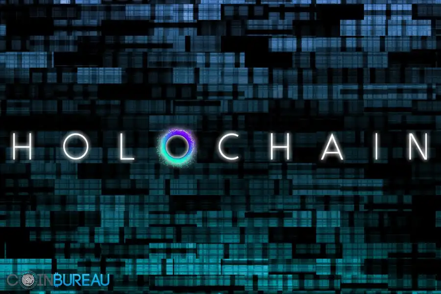
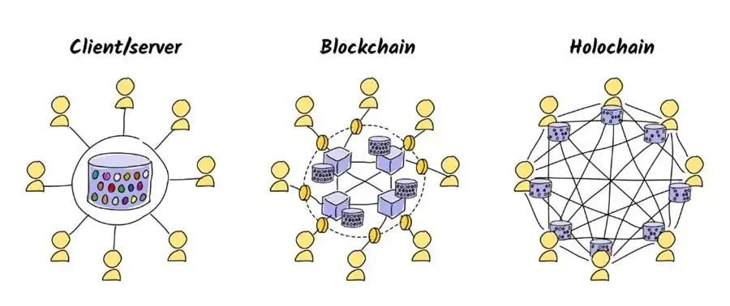

 

### **An end-to-end open source P2P app framework**

[Holochain](https://www.holochain.org) is a framework for developing and running decentralized applications (dApps) designed to be scalable, efficient and adaptable, featuring a peer-to-peer content distribution protocol, cryptography and hash tables. Unlike traditional blockchain architectures, Holochain uses a distributed hash table (DHT) to enable peer-to-peer communication and data storage, offering greater flexibility and performance for decentralized applications. It addresses effectively scalability challenges and is highly environmentally friendly.

 

 

A significant change enabling Holochain's innovation is its shift from a data-dependent blockchain to an agent-centric system. Unlike blockchain's need for global consensus, Holochain employs an agent system where each agent maintains a private fork, managed on the blockchain in a limited manner using a distributed hash table. This approach eliminates the scalability issues common to blockchain solutions, allowing decentralized applications (dApps) on Holochain to achieve more with fewer resources.

 

 

ThreeFold and Holochain will together go to market, Holochain as application layer being hosted on the ThreeFold Grid.

### **Partnership with ThreeFold**

The partnership between ThreeFold and Holochain merges decentralized infrastructure with advanced application development frameworks. By combining the strengths of both platforms, this collaboration seeks to drive innovation and expedite the adoption of decentralized technologies.

 

#### **How the Partnership Works**

 

**Integration of Services:** ThreeFold's TF Grid will integrate with Holochain's framework, providing decentralized hosting and storage solutions for Holochain-based applications. This integration will enable developers to deploy their dApps on a scalable and resilient infrastructure, enhancing performance and reliability for end-users.

 

**Benefits for Users:**

- **Enhanced Performance:** Users of Holochain-based applications hosted on the TF Grid will experience improved performance and responsiveness, thanks to the scalable and distributed nature of ThreeFold's infrastructure.

- **Increased Reliability:** By leveraging ThreeFold's decentralized hosting solutions, users will benefit from enhanced reliability and uptime for Holochain applications, reducing the risk of downtime and service interruptions.

- **Data Sovereignty:** Users will have greater control over their data and digital assets, as Holochain applications hosted on the TF Grid will adhere to principles of data sovereignty and privacy.

 

**Conclusion:** The partnership between ThreeFold and Holochain represents a strategic alignment of decentralized infrastructure and application development frameworks, aimed at empowering developers and users to build and deploy scalable, efficient, and resilient decentralized applications. By leveraging each other's strengths and capabilities, the partnership holds the promise of driving innovation and accelerating the adoption of decentralized technologies across various industries and use cases.

 

For more information about Holochain, visit [Holochain](holochain.org).
