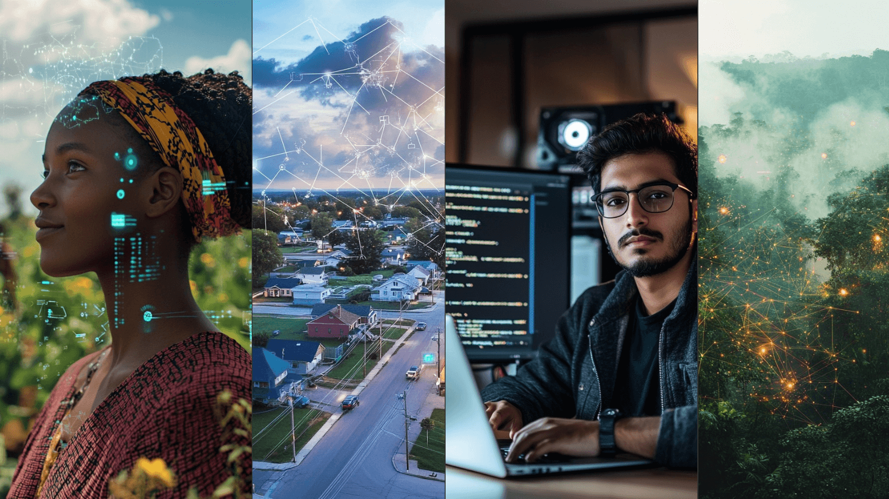

Imagine a digital world where control isn't dictated by centralized entities but by the collective power of a million interconnected nodes. This vision is more than just a technological advancement – it embodies a paradigm shift towards re-decentralizing the Internet and putting control back into the hands of its users, as it was originally intended to be.

 

Today's digital landscape is dominated by a few powerful entities that maintain control through centralized servers, proprietary algorithms, and restrictive data policies. These corporations often collect vast amounts of personal information, limit access to services, and dictate the terms of interaction.

 

Further, the majority of the data centers which house and power our digital lives are located in a handful of countries, keeping data, money, jobs, and other benefits inside of these nations and leaving developing regions behind. This leads to slower speeds, higher costs, lower levels of security, and numerous other disadvantages.

 

Democratizing digital infrastructure empowers individuals, communities, and organizations to participate in a shared ecosystem, where data ownership and governance are decentralized. People can interact directly with each other, exchanging information and value without intermediaries.

 

This foundation also enables a new era of decentralized artificial intelligence – where AI is trained, run, and improved across a global network, transparently, and inclusively.

#### From a Global Perspective

ThreeFold envisions a new internet, an alternative to the internet of today. To make this a reality, the ThreeFold Grid needs to reach a million (or millions of) nodes. A world with a million nodes ...

 

- Ensures that connectivity is no longer monopolized by a few large corporations. The Internet is more resilient to large-scale outages, cyber-attacks, and natural disasters. 
- Empowers people and organizations with control over their data. We are less vulnerable to data breaches and misuse of our data. 
- Lays the groundwork for decentralized AI, where algorithms are built on ethical, diverse data sets and innovation is open 
- Democratizes access to computational resources. Lower costs and scalable infrastructure fosters a global environment of innovation and drives economic growth and opportunity. 
- Means efficient and optimized energy usage, reducing the need for power-hungry data centers, and supporting global efforts to minimize negative impact on our planet. 
- Bridges the digital divide by introducing reliable Internet access to developing and remote regions, empowering them with access to crucial knowledge and information.
- Promotes global collaboration, creating a rich environment for cultural exchange and collective problem-solving at scale to tackle the world’s greatest challenges.
- Preserves cultural heritage, enabling communities from around the world to store their stories, information, and knowledge on infrastructure owned by them.

 

A world with a million nodes would reshape industries, facilitate global collaboration, and lay the foundation for a more resilient, inclusive, and sustainable digital future.

 

 

Let us explore, through the power of story, how this can come alive.

#### Tanzania

Salma, a young entrepreneur coming from an agricultural background in Arusha, runs a small but growing tech company developing mobile apps for local farmers. Her apps collect data from IoT sensors in the fields, helping farmers monitor soil moisture and temperature, optimize water usage, and predict crop yields. Powered by decentralized AI models trained on local data, the insights become increasingly accurate and tailored to the region’s unique conditions.

 

The apps run smoothly on locally-deployed decentralized infrastructure – the data processing happens seamlessly on the nearest nodes, ensuring low latency and quick insights for farmers. Further, farmers can be assured of 100% data ownership and sovereignty.

 

The farmers form a local cooperative to share data and knowledge. The decentralized cloud ensures that the data remains secure and private, allowing collective insights to be shared in a trusted way. A peer-to-peer marketplace enables farmers to sell their crops directly to purchasers, meaning they can now receive fair value for their work.

#### United States

Emma and Will live in a rural community in central Oklahoma, where tornadoes are a regular occurrence during certain times of the year. Emma is an elementary school teacher and Will works construction. Through a federal assistance program, the community has recently integrated its own decentralized cloud network.

 

Emma uses the network to access online resources and collaborate with educators globally. The local clinic offers telehealth services, so the community can access secure and private healthcare without the need to travel long distances.

 

Residents use a secure app for community discussions, support networks, local governance decisions, and safety alerts. Sensors across the community monitor weather conditions, while AI models trained on local weather patterns improve the accuracy of predictions, helping residents prepare and respond faster. Data is processed locally on the network, providing early warnings of severe weather events. Alerts are sent directly to residents’ devices. When disaster does strike, part of the decentralized network is able to stay online, supporting rapid communication and coordination and facilitating access to critical information.

#### India

Amit, a software developer based in Bangalore, is working on a new AI-driven application. His development environment is hosted on the decentralized cloud, giving him immense computational power at his fingertips. Training his AI models is faster and more efficient, utilizing powerful GPUs located close to him, increasing performance and lowering costs.

 

No longer dependent on centralized cloud, Amit appreciates he can now handle large-scale computations without high costs and the environmental impact associated with traditional data centers.

 

Amit not only accelerates his AI model training but also develops a mindset of innovation without boundaries. Empowered by seamless scalability and reduced operational costs, Amit channels his energy into refining algorithms that promise to redefine healthcare diagnostics. This newfound agility allows him to iterate rapidly, collaborate globally, and pioneer solutions that bridge the gap between technology and societal impact.

#### Brazil

In São Paulo, Rosina leads a team of environmental scientists focused on preserving the Amazon rainforest. Their research involves extensive data collection from remote sensors scattered across vast and often inaccessible regions of the rainforest. The data, including temperature, humidity, and biodiversity indicators, is crucial for monitoring climate change impacts and guiding conservation efforts.

 

Decentralized nodes located strategically across the rainforest process sensor data in real-time. Data collected from the rainforest remains secure and under local ownership. Local indigenous communities, equipped with smartphones, actively participate in data collection and monitoring (and use the decentralized network for the preservation of local culture). The insights derived from the program drive the training of decentralized AI algorithms, contributing to global climate research and advocacy efforts.

#### A World with a Million Nodes is Possible

This vision of a world with a million nodes connected to the ThreeFold Grid shows how technology can bridge gaps, enhance security, and foster innovation on a global scale. Each node plays a crucial role in building a resilient, inclusive, and efficient digital infrastructure for everyone, everywhere.

 

From AI development to sustainable farming, digital education to climate science and disaster response, decentralized infrastructure is transforming how people connect and create.

 

For years, the ThreeFold team and community have been quietly building the foundation. The technology is proven. The network is live. And the world needs what we have been building.

 

The grid today is a clear collective demonstration that all of this is possible. Scaling to a million nodes is an ambitious goal – but it’s also an invitation. An invitation to co-create a digital world where power is distributed, opportunity is shared, and progress belongs to everyone.

 

This is more than infrastructure. It’s a movement. One node at a time, we’re building the Internet – and the intelligence – that the world truly needs.