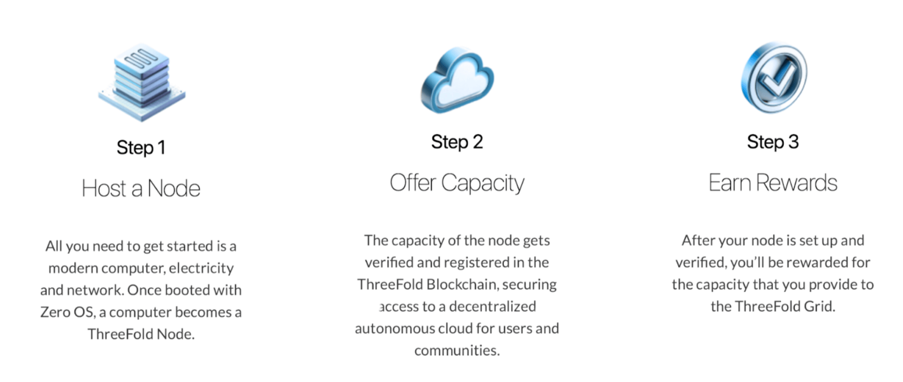

Cloud and Internet service providers form the backbone of our digital experiences. They host data and applications, and facilitate connectivity. Major corporations have long dominated this space. When the Internet started to become mainstream, it was necessary to scale the infrastructure quickly to meet growing demand. Thus, with their vast amounts of resources, big companies were the ones to build this infrastructure and offer services on top.

 

For decades, this has been the paradigm – big companies offer commercial services, and businesses and individuals pay for those services. Endless features, sleek design, and high levels of customer support make it easy and efficient for the user and make the services worth paying for. However, as “users,” we have had to give up a great deal of control and the sovereignty of our data. Further, most of the investment in infrastructure has been done in already-rich countries, leaving large populations in emerging markets without fair and affordable access to Cloud and Internet services. And the economic benefit of the entire industry has mostly stayed in the hands of the few large corporations operating these systems.

 

But a new way forward has emerged. Decentralized and edge computing solutions, such as those offered by ThreeFold, aim to empower individuals, strengthen control and promote a more resilient and environmentally-friendly approach to internet and cloud services. Edge computing, a cornerstone of this paradigm shift, involves processing and storing data closer to the source rather than relying on centralized servers. Leveraging edge computing offers many benefits. By processing data closer to its source, it reduces latency for real-time applications, enhances privacy and security, and empowers regions with local data storage. It also optimizes bandwidth, reduces costs, enables seamless scalability, and contributes to environmental sustainability by minimizing energy consumption. Thus, this initiative directly addresses existing limitations and is essential to creating a better infrastructure.

 

The best part? We can achieve it together.

### **Be a cloud service provider, not just a cloud consumer.**

With ThreeFold’s autonomous technology, anyone can be a cloud service provider without any technical expertise. You can be the Internet, for yourself and for those around you. 

 

Being a cloud service provider is a thrilling opportunity to tap into a market worth trillions of dollars – which today is being shared by a relatively small number of companies. This calls for change – a chance to level the playing field and allow more players to benefit from this lucrative industry. But it's not just about financial gain. By entering the cloud services space, you become a catalyst for change. You're not just providing a service; you're creating connections, bridging gaps, and fostering inclusivity. The people around you benefit, too. Lower costs, improved performance, data sovereignty and greater privacy are just some of the advantages they'll enjoy with your services. 

 

Finally, by contributing to a more sustainable edge cloud, you're not only ensuring a better future for yourself, but also for the planet. The adoption of a decentralized autonomous cloud reduces energy consumption and minimizes the environmental impact of data transfer, contributing to global sustainability efforts and a greener future.

 

Best of all, you're not just investing in technology - you're investing in a sustainable, connected and rewarding future, powered by the people, for the people. It's ultimately good for you, good for the people around you, and good for the planet. 

### **How to become a cloud provider?**

ThreeFold enables you to become a cloud service provider by hosting a 3node, bringing local capacity where people need it most and providing compute, storage and AI capabilities. After setting up this node, being verified and sharing capacity on our grid, your contribution is rewarded. 

 

Join the movement and [Become a Host](https://www.manual.grid.tf/knowledge_base/technology/grid3_howitworks.html)!

