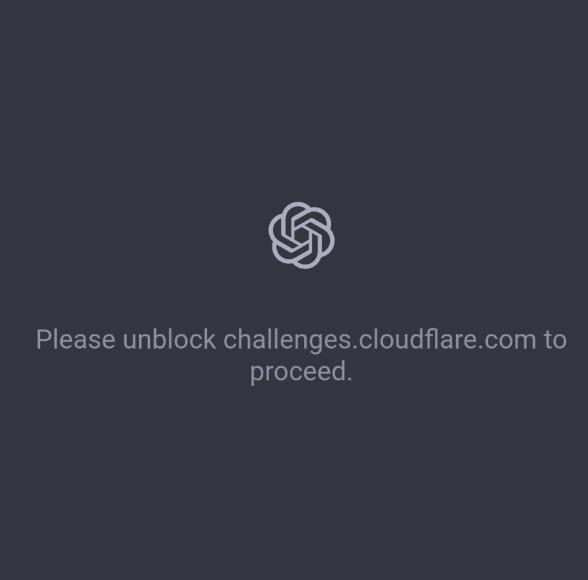

This genuinely felt like groundhog day.

 

On Tuesday, 18th November, a fifth of the world’s websites went down as Cloudflare went down. And yes, a lot of, so called, “decentralized” services also went down as a result. 

 

However, we have seen this movie before. Last month, we saw websites going down due to a [global AWS outage](https://www.threefold.io/blog/what-comes-next/).

 

This really begs the question. How resilient is the world wide web, if it is constantly dependent on centralized service providers?

 

Let’s understand what exactly happened.

### **The Update That Broke The Internet**

Cloudflare’s global outage wasn’t caused by DNS issues, an attack, or any systemic failure across the internet. 

 

Believe it or not, it just came down to a single configuration file used for bot mitigation. The file in question is automatically generated from live threat-intelligence feeds. It’s meant to update continuously to block bots, abusive traffic, and malicious patterns. At some point before the outage, its size expanded far beyond what the underlying software was built to tolerate.

 

Under normal circumstances the system reloads this file without incident. However, this time, the oversized file hit a latent bug inside Cloudflare’s bot-management engine, causing it to crash repeatedly.

 

Now, since this component sits in the request path for most Cloudflare products, its failure caused widespread 500 errors across the network.

 

Once that service collapsed, the effects rippled through Cloudflare’s global infrastructure. Websites depending on Cloudflare’s CDN, WAF, and bot filtering began failing almost simultaneously. Users saw generic “500 errors,” and even Cloudflare’s own dashboard and API became inaccessible. 

 

Major platforms like ChatGPT, X, Shopify, Uber, Spotify, Indeed, Claude, Perplexity, Canva, NJ Transit’s digital systems, and countless others were unreachable for hours simply because they are all fronted by Cloudflare’s global network.

 

 

Eventually, a fix was rolled out by late morning Eastern Time. Engineers patched the underlying issue, reverted the problematic configuration, and gradually restored dependent systems.

### **What Is the Solution?**

To his credit, Cloudflare CTO Dane Knecht admitted that the company "failed” its customers. However, an apology isn't enough when a system that is currently responsible for the global trillion dollar economy and other critical services is seemingly so fragile that it can't handle a single company's update.

 

Cloudflare “fixed” the issue. But did they actually heal the wound or put a flimsy little band aid? History tells us that it is likely the latter.

 

We saw the same pattern with AWS’s regional DNS failure, Microsoft’s global Azure collapse, and CrowdStrike’s faulty update that halted hospitals and grounded planes. Quick patches are applied, but the core fragility remains untouched.

 

This isn’t a Cloudflare problem.

 

It’s an internet architecture problem.

 

And that’s where alternatives must be taken seriously. 

 

Fixing configuration files is not the solution. Rebuilding the foundation is.

### **The ThreeFold Alternative: A Different Kind of Internet**

Instead of patching over the centralization crisis, ThreeFold rebuilds the foundation entirely.  

 

Instead of a few hyperscale providers powering the world, ThreeFold utilizes thousands of independent capacity providers to contribute compute, storage, and bandwidth to a unified, autonomous grid. Its Sovereign Agentic Cloud is designed around decentralization, autonomy, and distribution. The exact qualities today’s internet has lost.

 

ThreeFold works across three layers:

 

- **The Cloud:** A decentralized, Kubernetes-compatible cloud running on independent capacity providers instead of hyperscale data centers.
- **The Network:** A peer-to-peer mesh with built-in VPN, DNS, CDN, and gateways, creating a self-healing connectivity fabric.
- **The Agents:** Autonomous, user-owned digital agents running on decentralized compute, not Big Tech servers.

 

Together, these create an internet that grows more resilient as it expands.

### **Why This Actually Fixes the Problem**

ThreeFold’s solution represents a return to that original vision of the internet. A decentralized, sovereign, human-aligned internet that isn’t vulnerable to the failure of one company, one region, or one configuration file. As ThreeFold co-founder Florian Fournier puts it:

 

*“The internet was meant to be a network of peers, open, resilient, and free. Over time, it became a network of platforms.”*

 

ThreeFold’s work is aimed at rebuilding the web from the ground up. This is not a band aid. Our solution dares to restructure what is broken. And In a world where a single file update can cripple platforms worth billions, it’s clear that this is the direction the internet should have taken all along.

 

Do you want to join our mission? [Start here](https://docs.threefold.io/docs/introduction/) and [stay tuned](https://t.me/threefoldnews).
