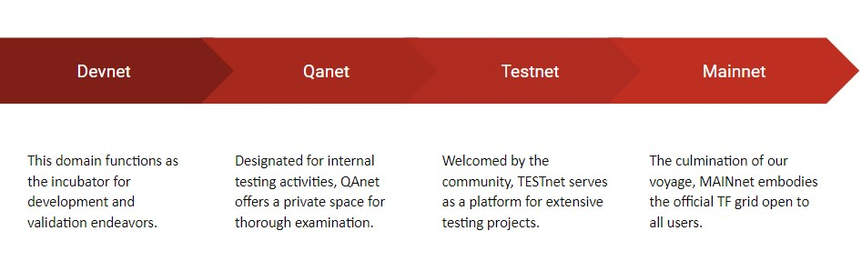
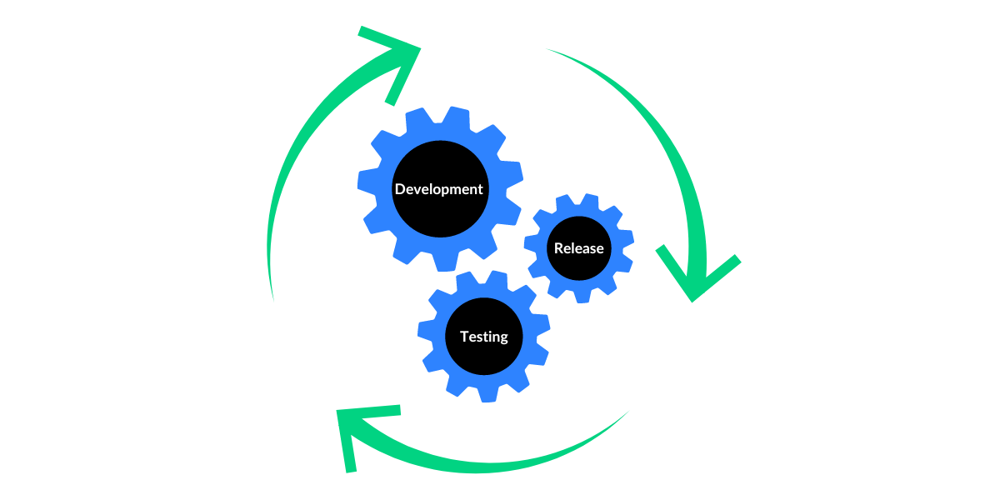

Hi there and welcome to ThreeFold Grid Testing: Part One!

 

In this blog, we will introduce you to the overall cycle of testing on the TFGrid. Before releasing anything to the mainnet, TF engineers test three different networks: Devnet, Qanet, and Testnet. Testing also continues on the Mainnet even after the release of the updates. Today, we will go through the major steps of this process. 

### **But first – why is testing important?**

Testing upgrades as they're developed ensures we have a stable operation of the TFGrid that is constantly optimal for our community. It lets us see what works well and what still needs fixing. By the time our community gets these upgrades, they've been tested many times to make sure they're top-notch.

 

When it comes to testing the developments on the ThreeFold Grid, we need to be careful, especially when we're doing separate tests from the different networks. If we don't focus on testing the developments independently, testing can become a lot slower and more complicated.

 

**Different networks for testing:** We test on 3 different networks before we release anything on Mainnet.

 

### **Testing all Networks sequentially**

Our journey through these networks follows a well-defined path.

 

First, verification starts on Devnet with the dev team leading the validation process. Once the development team approves, we release the grid to the Qanet for further examination.

 

The QA teams conduct iterative test runs within Qanet, leading to a Bug Assessment Meeting to address reported issues. If the release is deemed ready for deployment, it moves to Testnet for an extended observation period.

 

Following two weeks of rigorous testing on Testnet releases advance to Mainnet once a community vote approves a Grid Enhancement Proposal, indicating readiness for widespread adoption. As the release enters Mainnet, QA teams begin new test iterations to ensure a smooth transition for user accessibility.

 

Testing is done both manually and automated: 

 

**Manual testing:** At the core of our testing process is the thorough manual inspection of components using the advanced [Testlodge](https://manual.grid.tf/knowledge_base/collaboration/testing/testlodge.html) tool. 

 

**Automation Testing:** We also run Automated scripts on GitHub actions daily; to give us an early indication about the TFGrid.

 

We will go through these two types of testing further in part two.

### **Conclusion**

The testing journey within the ThreeFold Grid is intentionally and necessarily thorough, a delicate balance between manual precision and automated finesse, all designed to provide a strong and reliable cloud infrastructure for our users. Next time, stay tuned for more updates on how we conduct these tests and how they help us improve the grid's reliability. [Join us](https://t.me/threefoldtesting) as we strive for excellence and continue to advance in the world of decentralized technology.