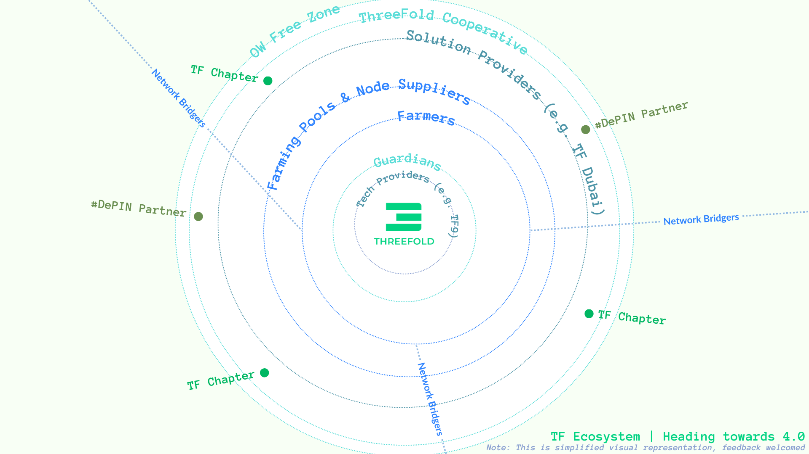

Collaborative. Self-organizing. Interconnected. Dynamic. Diverse. Resilient. Sustainable.

 

These are some of the words that come to mind when thinking about nature and natural systems. For billions of years, nature has been showing us the way. From the human body to rainforests to coral reefs, decentralized systems are all around us – and even inside us – giving examples of the power of collective action, the resilience of distributed networks, and the wisdom inherent in shared decision-making and autonomy.

 

ThreeFold has always acted in a decentralized way – through the creation of public community chats and forums, by hosting regular community calls, through Grid Enhancement Proposals / DAO votes, and more. Different entities participate in the project – TF9 (previously TF Tech) creates the technology, TF DMCC promotes the TF Grid and develops services, the farmers add capacity, grid users deploy on that capacity, token holders support the project through buying the token, and so on.

 

As we enter the next phase of ThreeFold, the project will move into an even greater level of decentralization, where each role is clearly defined and benefits the greater whole, while we introduce layers to make us – and our grid – more resilient and reliable.

 

So, what are these roles? How does it all come alive?

 

- **Farmers**, or Cloud Service Providers, provide the infrastructural foundation of the ecosystem. Without the farmers, there is no ThreeFold.

- **Network Bridgers**, or Providers, bridge the new and the old. They ensure that ThreeFold can communicate with the existing Internet in a safe and secure manner – and provide bandwidth to our grid.

- **Farming Pools** exist to support farmers in being more effective, to improve uptime, and to deliver a service level to the community. This means more reliability for all.

- **Node Suppliers** build and sell nodes and provide an adequate level of service and support.

- **Guardians** protect the network, keep all relevant services up and running, validating the soundness of the technology being used.

- **TF Dubai** is the original company out of which the ThreeFold project began and is now developing commercial services on top of the grid. TF Dubai is a big sponsor of the grid and will continue to be. It wishes to hand off the day-to-day management to the ThreeFold cooperative, and the digital tools have been set up to do so, including the forum, websites, manuals, and web management tools.

- **[TF9](https://tf9.io)**, previously TF Tech, is a Belgium-based company playing a key role in the ecosystem. They have been developing the technology behind the TF Grid and are 100% committed to keeping it open-source. TF9 will be licensing the software to organizations who need commercial support and customizations.

- The **ThreeFold Cooperative** is our governance layer; it gives everyone in the ecosystem a voice and an environment from which to operate.

- **OurWorld Digital Free Zone**, which is in the process of being created in Zanzibar, allows the ecosystem to structure digital assets and some of our future digital projects.

 

But it does not stop there. More **solution and technology providers** will create and provide services and open-source technologies that can be used on top of or as part of the grid. **DePIN partners** are coming, to launch us into that space. And **ThreeFold Chapters** will come alive to promote and grow the ecosystem organically, with local context, driving maximum reach and adoption of our project.

 

 

It is easy to see that each of these roles plays a crucial element in the larger ThreeFold ecosystem, establishing a type of equilibrium and resilience that can be found in natural systems as well. All participants with their own unique purposes – self-organizing, interconnected, collaborating towards a common goal. Together, let us strive to emulate the harmony of natural systems as we move into this next phase of ThreeFold.

 

There are many ways to get involved:

 

- Join our [main chat](https://t.me/threefold), talk to humans
- [Learn](https://manual.grid.tf/) about expanding the grid or deploying on top of it
- [Buy and hold](https://manual.grid.tf/documentation/threefold_token/buy_sell_tft/buy_sell_tft.html) the token to provide fuel to the ecosystem
- [Stay tuned](https://t.me/threefoldnews) for news, updates, and community calls
- Take part in the [feedback](https://forum.threefold.io/t/feedback-on-our-tfgrid-3-14/4276) about the next steps for ThreeFold

 

*"Look deep into nature, and then you will understand everything better." - Albert Einstein*
