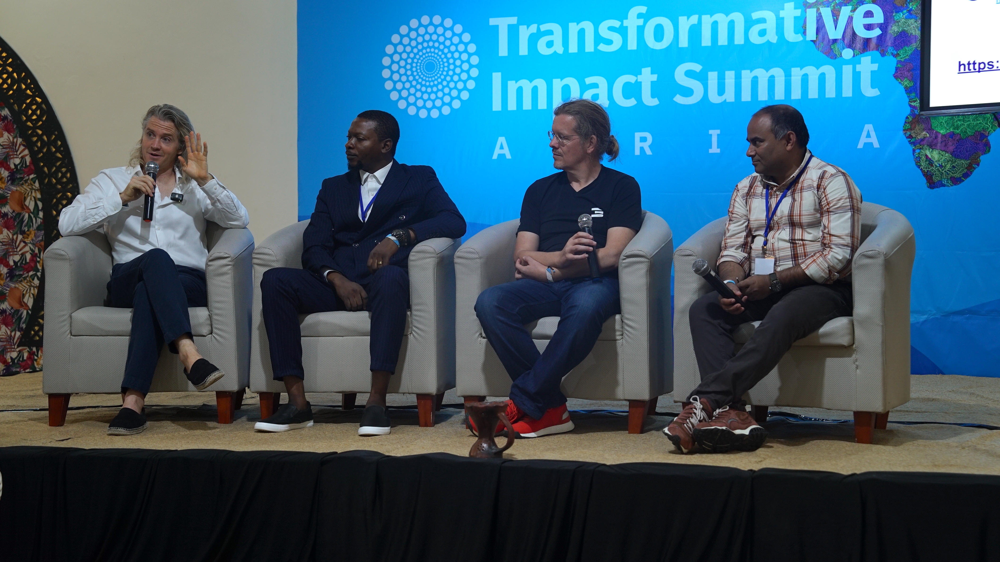
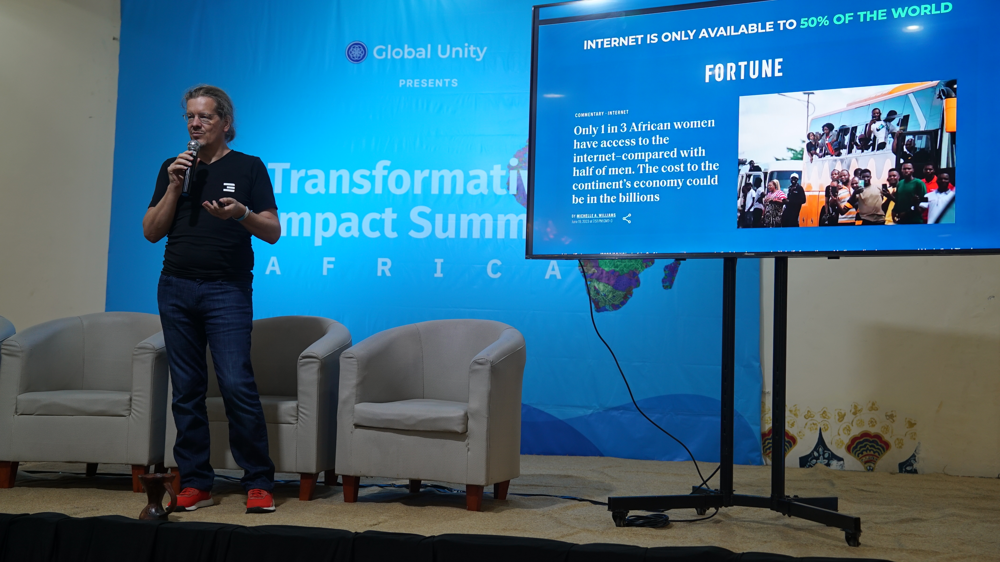
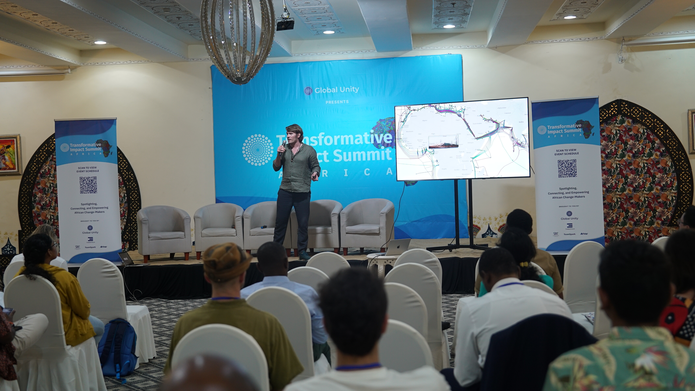

*“By bringing together those dedicating their lives to making the world a better place, and empowering them with exposure, support, connection, and funding, we not only celebrate transformative impact, we create it.”*

 

Held this June 7 - 9 in Zanzibar, Tanzania, the [Transformative Impact Summit](https://www.transformativeimpactsummit.com/p/2024) convened with this important focus, attracting an audience of people from around the world working across the entire impact ecosystem, along with students from local IT universities, and government officials from Zanzibar.

 

A [jam-packed three-day schedule of focused talks](https://www.catalist.network/1-column-agenda/tis-africa-24) gave essential background and context to the incredible group of participants and their initiatives. Different tracks for the summit included Financial Innovation, Regenerative Finance, Regenerative Agriculture and Food, along with health and social connection, and AI, Web3, and Tech for Good.

 

 

The diverse array of speakers and topics included:

 

- Kristof, Florian, and Greg from the ThreeFold team (more on this below)
- Matthew Schutte, co-founder of [HoloChain](https://holochain.org), who talked about HoloChain and their perspective on application development
- Omrei Abumadi, founder of [VVerse](https://www.vverse.co/) (a ThreeFold & OurWorld collaborator), who discussed the metaverse and showcased a virtual environment built just for the event
- Victor Muhagachi and David Machuche, co-founders of [Chatafisha](https://chatafisha.com/) and [Dunia Yetu](https://forum.threefold.io/t/introducing-dunia-yetu/4147) collaborators, who spoke about how FinTech can empower Africa’s waste pickers
- Dr. Cornelia Wallner-Frisee, co-founder of [Africa Amini Life](https://www.africaaminilife.com/en), who presented “Education is Our Strongest Medicine”
- El Fuego Mutaz, Head of Africa at [Refunite](https://refunite.org/), a tech non-profit that uses technology and innovation to provide humanitarian assistance, who spoke about how technology can reconnect families, as well as reshaping the future of aid with local community leadership

 

Partnerships were forged, friendships were formed, and at least one project received some funding – other outcomes remain to be seen, as it has only been a few days since the summit ended.

### **Why Zanzibar? Why Now?**

Last April, some of the ThreeFold team attended Zuzalu, a two-month “pop-up city” co-created by Vitalik Buterin, who was inspired in part by the idea of network states and wanting to simulate new ways of living together.

 

During those weeks, we had the opportunity to engage with a wide variety of interesting and innovative organizations and individuals. It was an amalgamation of people from around the world, some there for Web3, some for longevity, others network states, and many with a focus on impact.

 

One person we really connected and aligned with was Elliott Bayev of [Global Unity](https://www.globalunity.org/), who has since become a dear friend of our project. Elliott is a super-connector, weaver of people and concepts, and storyteller – on a mission to unite humanity and empower global cooperation. At the time, he was in the midst of planning for the first Transformative Impact Summit, which was held last fall in New York City during UN Climate Week.

 

While at Zuzalu, with Elliott and others, we often talked about the noticeably low presence of attendees from certain regions, specifically Africa. Visa restrictions and sometimes lack of resources made it difficult for this audience to attend. This seemed unfair, to say the least, and did not allow for these important voices to be heard.

 

What resulted was a commitment to do our part in bringing these types of conversations to the African continent. ThreeFold partnered with Niklas Anzinger to create the [Africa Regenerative Cities Summit](https://lu.ma/zanzibar_regen) last July and did a follow-up event last November. We’ve hosted and participated in other smaller events in Zanzibar and nearby Dar Es Salaam. Now, Elliott has brought the second Transformative Impact Summit to Zanzibar. (And we'd be remiss not to mention the team who put together and hosted [Zanzalu](https://zanzalu.super.site/), a direct spin-off / extension of last year’s Zuzalu.)

### **ThreeFold at Transformative Impact Summit**

ThreeFold was honored to present on a few different occasions throughout the summit and had the pleasure of hosting two evening events for speakers and attendees.

 

 

On the first day of the summit, our co-founder Kristof De Spiegeleer spoke on the topic of Public Private Partnerships being a model that can change Africa, and on Saturday he spoke on a panel about uplifting Africa with technology and more specifically about ThreeFold, OurWorld, and the OurWorld Digital Free Zone project.

 

In addition, ThreeFold ecosystem developer Florian Fournier spoke on the topic of crafting a conscious society for our world on the second day. And Gregory Flipo, co-founder of Sikana and ecosystem developer for ThreeFold presented on educational video content on a global scale. Crucially, all three were clear in communicating that new decentralized and sovereign infrastructure and systems are key to enabling truly transformative impact.

 

 

While the talks throughout the summit inspired and gave context, much of the magic happened in the evening gatherings or even now after the summit has ended, where we have been able to connect more one-on-one to explore ways of collaboration with some of the attendees and speakers.

### **What’s Next?**

Elliott and Global Unity continue their efforts to connect and empower individuals and organizations dedicating their lives to making the world a better place, with a strong commitment to Africa and its people. Their next event will be the annual Transformative Impact Summit in NYC during Climate Week, September 27-29.

 

We, the ThreeFold team, will continue to collaborate with Elliott and his team, finding opportunities to support each other – and as active participants in the Global Unity / Transformative Impact network, we see many possibilities unfolding.

 

Primarily, impact projects need responsible digital infrastructure. ThreeFold could be a perfect choice for the impact space and we are eager to collaborate.
