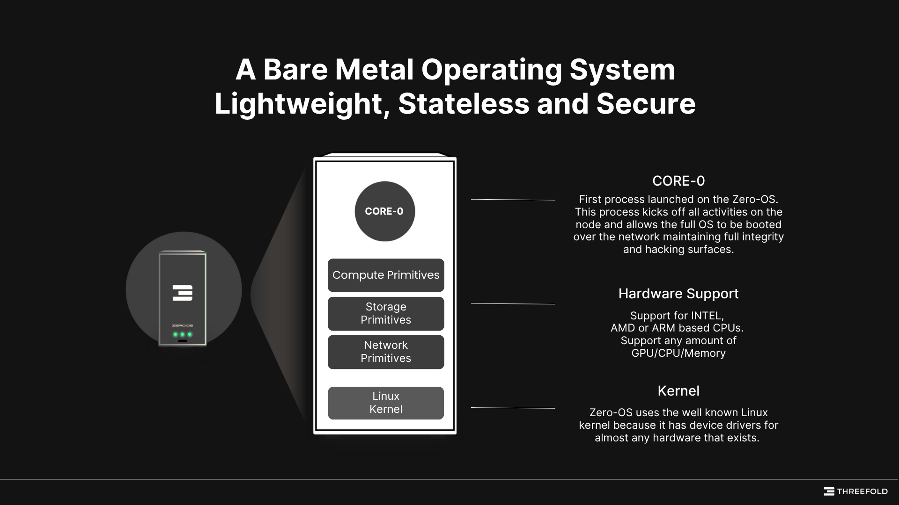

What is true digital sovereignty?

 

When it comes to digital infrastructure, using "open-source software" or "decentralization" just skims the surface. For true digital sovereignty, you need control, verifiability, and autonomy at every layer of the stack, from physical hardware to workload orchestration.

 

ThreeFold achieves this through a radical reimagination of how internet infrastructure is provisioned, owned, and operated. 

 

At the core of this design is **[Zero OS](https://github.com/threefoldtech/zos)**, an autonomous, minimalist operating system purpose-built to deliver compute, storage, and network primitives without relying on centralized infrastructure, traditional sysadmin practices, or hyperscaler capital.

 

Zero OS has been specifically designed to ensure that:

 

- A high level of computer expertise is typically not required to set up a node. 
- There is virtually zero maintenance after initial setup. All updates happen automatically. 
- Recovery from power or network loss happens without human intervention.

### **What is Zero OS?**

 

Zero OS is a stateless, bare-metal runtime environment, employing a minimalist design built from scratch around the Linux kernel. It exposes a tightly scoped set of primitives for compute, storage, and networking.

 

- **Headless by Design:** Runs entirely autonomously after boot. There's no need for user intervention post-deployment.
- **Ephemeral & Immutable:** The root filesystem is read-only, and all system behavior is stateless and declarative.
- **Ledger-Driven Provisioning:** Nodes listen to a blockchain-based reservation system and respond by deploying the workloads described in those reservations.

 

It has no package manager, no local user accounts, no shell access, and no remote management via SSH. This drastically reduces the attack surface and operational complexity.

 

The OS acts as a waypoint, converting instructions stored on a distributed ledger into real-world compute deployments. 

### **Composable Primitives**

Instead of exposing bloated APIs or fully fledged orchestration platforms, Zero OS provides a narrow but composable set of system primitives:

 

| **Primitive**     | **Functionality**                                                                 |
|-------------------|------------------------------------------------------------------------------------|
| **VM**            | Stateless KVM-based virtual machines with declarative configuration               |
| **ZeroDB (ZDB)**  | A lightweight key-value store with optional encryption                            |
| **Mycelium**      | Mesh-based overlay network with IPv6, E2E encryption, and NAT traversal           |
| **Network Setup** | Create private networks, web gateways, public IP exposure                         |
| **Filesystem**    | Encrypted, snapshot-based persistent volumes using ZFS                            |

 

These primitives can be composed by developers or workload orchestrators (like ThreeFold Labs or TF Grid SDKs) into more complex services, such as Kubernetes clusters, storage grids, VPNs, or decentralized databases, all without a central coordinator.

### **Programmatic Trust via Blockchain Coordination**

Instead of relying on centralized control systems like AWS Control Tower or Google Cloud IAM, Zero OS nodes operate through a decentralized model driven by TFChain and peer-to-peer communication.

 

Each node is associated with a Twin ID, a unique digital identity stored on TFChain. When a user wants to deploy a workload (like a VM or database), they submit a reservation smart contract to TFChain. This contract includes a cryptographic signature from the user's Twin and a hash of the workload deployment.

 

Here’s how it works:

 

- The blockchain confirms billing authorization and verifies the hash of the deployment. This creates an auditable, tamper-proof record.
- The full deployment instructions (including specs like CPU, memory, storage, and network) are transmitted off-chain via RMB (Remote Message Bus), end-to-end encrypted, from the user to the node.
- The node monitors TFChain for reservations tied to its Twin ID, verifies the signature and hash, and then automatically provisions the workload. No human intervention needed.

 

This setup ensures:

 

- **Auditable Infrastructure:** Every change is logged on-chain.
- **Trustless Automation:** No need for sysadmins or manual approval.
- **Sovereign Ownership:** Each workload is cryptographically linked to its creator.
- **Efficiency:** By transmitting heavy deployment data off-chain via RMB, blockchain usage is minimized, reducing on-chain storage and compute load.

 

Just like Ethereum smart contracts execute code, ThreeFold nodes execute real-world workloads. Driven by a hybrid architecture that blends blockchain trust with encrypted peer-to-peer efficiency.

### **Grid Networks for Safe Testing and Rollouts**

Zero OS runs across several different network environments, each designed for a specific stage in the development and deployment process. This setup helps the system evolve safely without risking the stability of the live grid.

 

Here’s how the networks work:

 

| **Network** | **Description** |
| ----- | ----- |
| Production | This is the live network used in the real world. It’s stable, fully audited, and cannot be reset. Only proven, trusted features are allowed here. |
| Test | Used to test new features at scale. It’s close to production quality, but some releases might still contain bugs. Resets are possible though very rare. |
| QA | For early-stage features still being tested. It may lag behind active development and can be reset if needed. |
| Dev | A temporary network just for developers to experiment and debug new code. It can be reset at any time. |

 

This tiered model makes sure that:

 

- New features are tested step by step
- Production remains stable and secure
- Developers can safely build and improve the system without risk to users.

### **True Sovereignty at the System Level**

ThreeFold, through Zero OS and the TF Grid, decentralizes the cloud and rebuilds it from the ground up, with sovereignty, automation, and composability at its core.

 

Zero OS isn’t just an operating system. It’s a self-operating system.

 

And in a time when data, identity, and computational infrastructure are geopolitical battlegrounds, that changes everything.

#### **What Does it Enable?**

Think about this:

 

- A school in Uganda can run its own local cloud with no data ever leaving its premises.
- A nation-state can build a national cloud grid without relying on a centralized provider.
- A developer collective can launch resilient apps that survive even if core internet services go down.

 

This is infrastructure-native sovereignty. Not just ownership of software, but autonomy over the full lifecycle: deployment, operation, upgrade, and recovery.

 

With Zero OS and the ThreeFold Grid, you move from dependency to autonomy.

 

That’s what makes ThreeFold truly sovereign tech.  
Not just infrastructure. Not just decentralization.  
But total autonomy, by design.

 

The future is self-owned, self-operated, and borderless.

 

Whether you're an individual, an enterprise, or a grassroots community, the tools to build your own cloud, on your own terms, are finally here.

 

Start building sovereignty today.

 

**[Explore how Zero OS](https://github.com/threefoldtech/zos)** and the **[ThreeFold Grid](https://docs.threefold.io/docs/introduction)** can power your next step.

