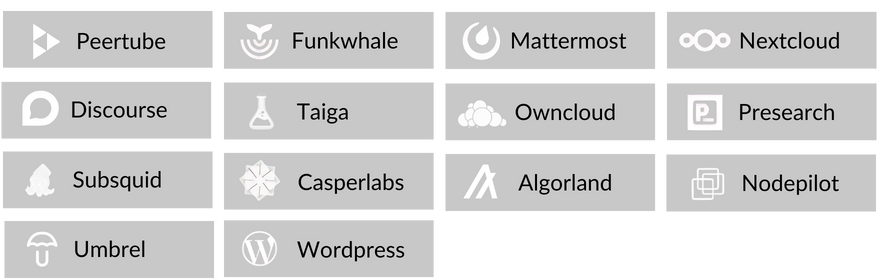

<!-- section 1 (header) -->

 

|||

### **Build Your Own Digital Experiences**

## **Deploy On The Grid**

ThreeFold has developed extensive technology and tools for developers and system administrators.

 

From decentralized cloud computing and blockchain integration to overseeing infrastructures and optimizing performance, there is a breadth of options for smooth and efficient operations.

 

<button class="green">[Developer Documentation](https://www.manual.grid.tf/documentation/developers/developers.html)</button> 
<button class="blue_b">[Sysadmin Documentation](https://www.manual.grid.tf/documentation/system_administrators/system_administrators.html)</button>



<!-- section 2 Key Features -->



### **Deploy With ThreeFold**

## **Key Features**





**ANYTHING LINUX CAN RUN ON THE GRID**

Anything that runs on Linux can run on ThreeFold's innovative operating system, guaranteeing compatibility and flexibility.

|||

**VIRTUAL MACHINES & GATEWAY TECHNOLOGY**

ThreeFold’s gateway tech allows any node on the grid to obtain a FQDN, secure mesh network traffic, and synced configurations. Coupled with our VMs, the possibilities are endless.

|||

**ONE-CLICK SOLUTION FOR WORKLOADS**

The Grid offers ready-community solutions to deploy industry-grade workloads in one click. You can also build your own solutions thanks to the open-source nature of the grid.





**OPEN SOURCE LOW LEVEL OPERATING SYSTEM**

Enables anyone to become a cloud provider. This operating system supports all required Web2 and Web3 workloads.

|||

**PEER TO PEER MESH NETWORK**

The only overlay network which considers locality: routing decisions are based on peer proximity. Offers privacy and redundancy that are currently not possible elsewhere.

|||

**QUANTUM SAFE STORAGE SYSTEM**

QSSS is capable of storing data in ways that are indestructible, efficient, and ultra-scalable. Storage algorithms fragment and disperse files over multiple nodes.





**TOOLS AVAILABLE FOR SYSADMINS**

Deploy your own workload architectures with tools such as Terraform, Pulumi and Kubernetes.

|||

**AI AND MACHINE LEARNING WORKLOADS WITH GPU**

The grid supports GPU nodes enabling artificial intelligence and machine learning workloads within minutes.

|||

<!-- don't write here -->

**AI AND MACHINE LEARNING WORKLOADS WITH GPU**

The grid supports GPU nodes enabling artificial intelligence and machine learning workloads within minutes.



 



<button class="green">[Dive Deeper](https://manual.grid.tf/documentation/developers/developers.html)</button>



<!-- section 3 applications  -->



## **Ready Community Applications**

#### **Easily deploy your favourite applications on the ThreeFold Grid with a click of a button**

 

 

<button class="green">[Learn More](https://manual.grid.tf/documentation/dashboard/deploy/applications.html?highlight=ready#)</button> 
<button class="blue_b">[Deploy Now](https://dashboard.grid.tf)</button>



