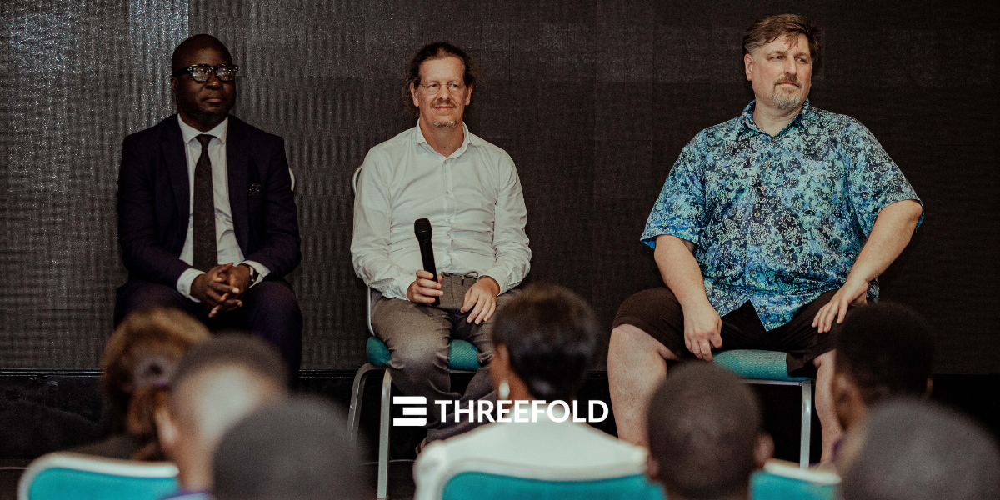
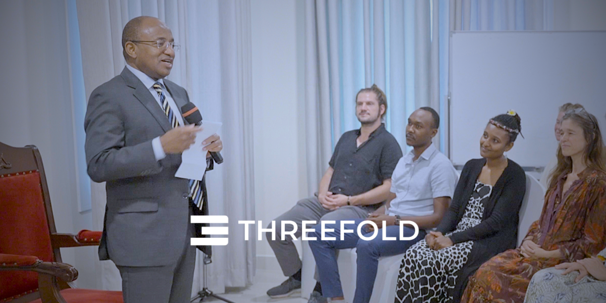

<!-- section 1 (header) -->



#### THREEFOLD  

## **Enabling Digital Sovereignty**

The Internet began as a free and open network for all.
 Now it's centralized, controlled by big tech, and only available to about half of the planet.
 
 The Internet needs a new "plumbing layer": free, private, and secure.   

**ThreeFold has developed a decentralized, self-healing, secure system which has the potential to make the Internet available to everyone on this planet.**

 

<button class="blue_b">[Host](/host)</button><button class="blue_b">[Deploy](/deploy)</button><button class="green">[About](/about)</button> 

|||



<!-- section 2 (logos) -->



## **logo**



<!-- section 6 (COLLABORATION) -->



#### COLLABORATION, INNOVATION, EVOLUTION

## **A Decentralized Future for Us All**

 

The sum of our collective digital lives requires **a physical infrastructure** to house and connect us all. Today that infrastructure **has been centralized** in the hands of a few powerful entities, leading to **issues around control, privacy, security, accessibility, and impact on the planet**. This often dictates how we interact, store our data, and access information, creating single points of failure and potential misuse.

 

**But there is a better way forward.**

 

ThreeFold believes in **open-source collaboration** to **empower human potential**.

Together, we create, host, and **co-own** the foundational layer of an **upgraded Internet**.

 

**Our story is a collective story. Let’s write it together.**

 

<button class="green">[Learn More](/about)</button>



<!-- section 3 (Map) -->



#### LIVE AND OPERATIONAL

## **The ThreeFold Grid**

ThreeFold enables a true alternative to power-hungry, centralized data centers. The ThreeFold Grid is a global network of Cloud capacity connected and owned by people, not big tech.

**Version 3.14 is live on Mainnet**



<!-- section 4 (Host the cloud) -->



#### HOST THE CLOUD

## **It starts with Nodes**

3Nodes are specialized computers running Zero OS, an operating system invented by the ThreeFold team, enabling anyone to provide decentralized compute, storage, and network capacity to the ThreeFold Grid – and earn for it.

 

<button class="blue_b">[Get A Node](/getnode)</button>
<button class="green">[Build A Node](https://manual.grid.tf/documentation/farmers/3node_building/3_set_hardware.html?highlight=diy%20node#introduction)</button>

|||



<!-- section 5 (INCA) -->



|||

#### THREEFOLD GOES COMMERCIAL

<h3 class="font-semibold">Meet Project INternet CApacity</h3>

For years, ThreeFold has been quietly and steadily developing its revolutionary technology on mainnet, with a solid foundation of mature infrastructure that is now ready to take the next leap forward.

 

We are now entering a new phase of the ThreeFold Grid with the Grid 4.0 and Project Internet Capacity. As we transition into this next phase, we're enabling commercial entities to seamlessly build on the grid.

 

<button class="blue_b">[Learn More](https://threefold.info/projectinca/projectinca/intro.html)</button>



<!-- section 8 (Decentralized Cloud) -->



#### BETTER FOR PEOPLE, BETTER FOR OUR PLANET

## **What We Resolve**



 



 

#### **Privacy**

Users maintain control over their data and minimize the risk of data breaches by processing information closer to its source.

|||

 

#### **Sovereignty**

Enables nations and individuals to control their Internet capacity, promoting digital independence through an autonomous cloud network.

|||

 

#### **Performance**

By processing data closer to users, it reduces latency and improves real-time responsiveness.





 

#### **Cost Efficiency**

Reduces costs by minimizing data transmission over centralized networks.

|||

 

#### **Scalability**

As devices multiply, central data centers face data overload. Edge cloud distributes processing and boosts scalability.

|||

 

#### **Green**

Uses local resources to cut the carbon footprint and promotes eco-friendly practices with decentralized hosting.



<!-- section 9 (Ecosystem) -->



<h4 class="green_text">ECOSYSTEM</h4>

## **Utilization Partners**

ThreeFold’s decentralized autonomous cloud will empower many projects and digital experiences as we grow. Here are some of the first projects to come alive.





#### **Social Network**

Earth Staking’s Social Network is the first Bitcoin Staking Layer 2 on Earth, collaborating with ThreeFold to improve security, scalability, and energy-efficiency.
      

|||

#### **Our World Free Zone**

ThreeFold is working with ZICTIA, on behalf of the Zanzibar government, to create the world’s first 100% Digital Free Zone – accessible and affordable for all.
      

|||

#### **Sikana**

Sikana is on a mission to empower individuals with practical skills through free educational videos – local content in local languages on top of local infrastructure.
      



 



<button class="blue_b">[Learn More](/partners)</button>



 

<!-- section 10 (news) -->



## **Top News**





 

##### Sovereign Internet: A game changer for Tanzania

|||

 

##### ThreeFold signs agreement with Zanzibar government for Digital Free Zone

|||

<h3 class="mt-0 font-semibold">JOIN IN</h3>

 

 <a href="https://manual.grid.tf" target="_blank">
    <h4 class="text-xl green_text font-normal my-0">Manuals</h4>
    
Dive deeper into our technology

    </a>
    

     

     <a href="https://threefoldfaq.crisp.help/en/" target="_blank">
    <h4 class="text-xl green_text font-normal my-0">Support</h4>
    
Get assistance from our Support Team

    </a>
    

      

      <a href="/community" target="_blank">
    <h4 class="text-xl green_text font-normal my-0">Community</h4>
    
Be part of our journey and participate

    </a>
    



