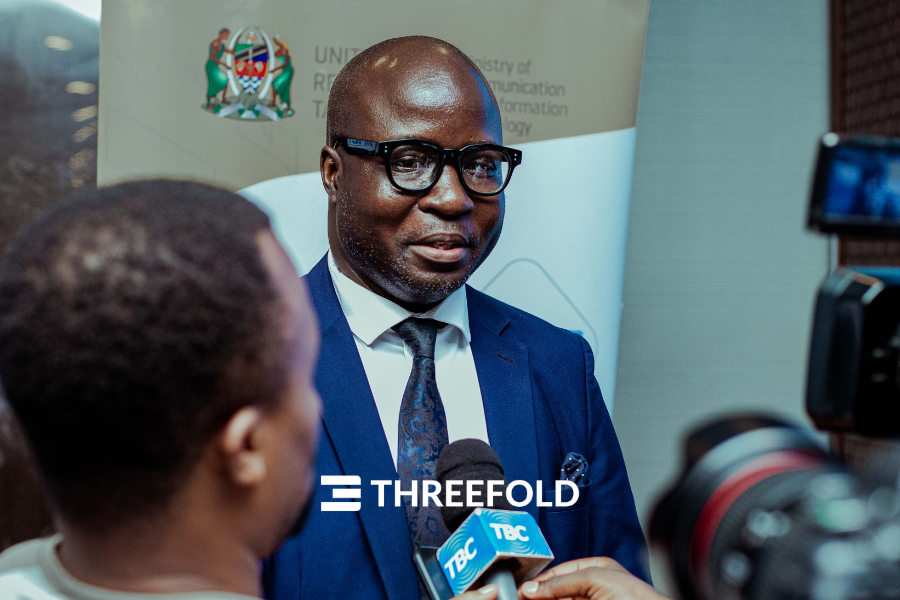
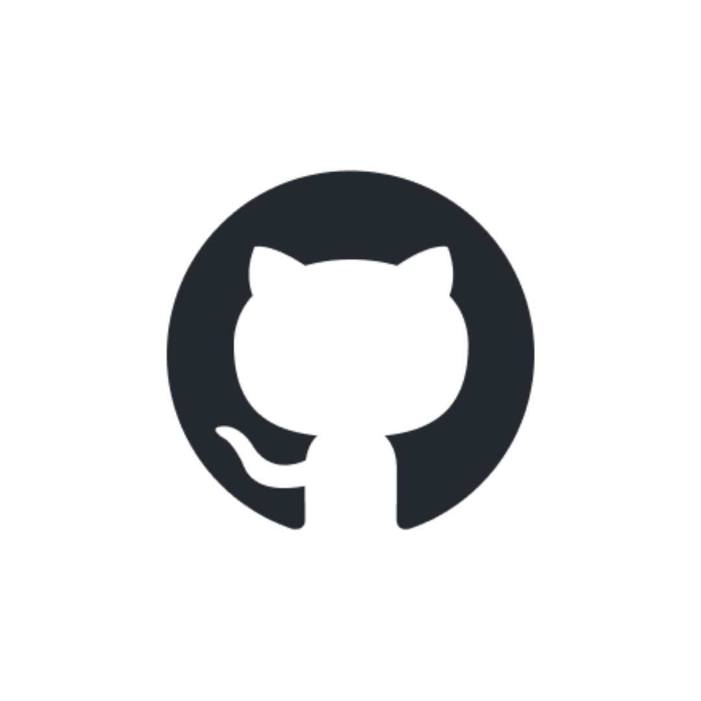
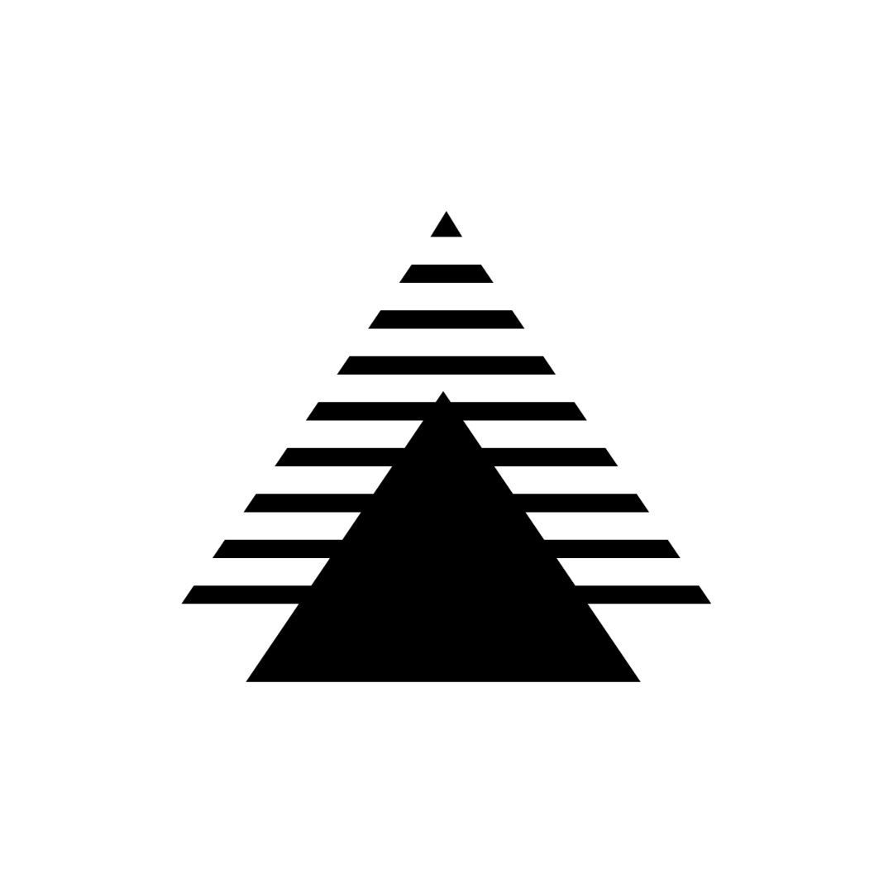
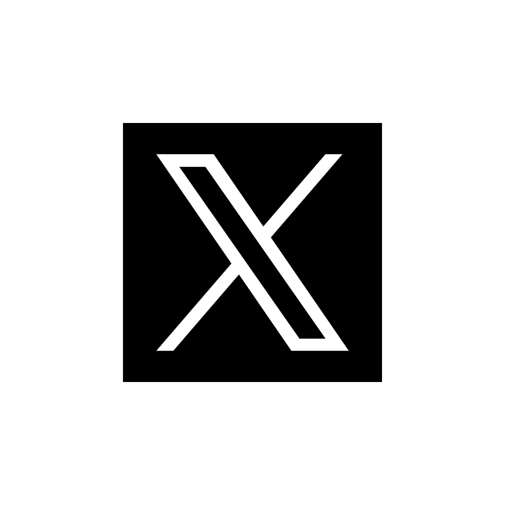

<!-- section 1 (header) -->

<!-- 

    

      

       

          

            
          

        

        

          

            <h2>Decentralized. Autonomous. Internet Infrastructure.</strong></h1>
            
ThreeFold is a globally-distributed grid of storage, compute, and network capacity, acting as "no middleman" Internet resources between independent capacity providers and users.

            <button class="mx-0"><a target="_blank" href="https://manual.grid.tf/intro/intro_readme.html">Get Started</a></button>
          

        

      

    

  
 -->



## **Decentralized Autonomous Cloud**

ThreeFold is the world’s first system enabling anyone to become a cloud and internet service provider, empowering people and organizations to buy, sell, and use cloud resources autonomously and securely.

 

#### #DePIN #DeCloud #AutonomousIT

|||



<!-- section 4 (Map) -->



### Become a cloud & internet service provider on

## **The ThreeFold Grid**

Provide cloud and internet capacity in your area and become a part of the largest and most advanced decentralized autonomous cloud network in the world.





## **It Starts with 3Node**

3Nodes, powered by our stateless operating system, Zero OS, allow anyone to earn by providing compute, storage, and network capacity to the ThreeFold Cloud. Pre-configured plug and earn 3Nodes for beginners, or do it yourself 3Nodes for builders

<button>[Get Started](/host)</button>

|||





## **Our Partners**

### Driving utilization on top of our decentralized autonomous cloud









## **Why Decentralized Cloud**

### How bringing data closer to the end user is beneficial for everyone





 

### **Latency Reduction**

For real-time apps, central cloud delay is prohibitive. Edge Cloud cuts latency locally.

|||

 

### **Privacy & Security**

By processing data locally, edge cloud reduces the exposure to data breaches and cyberattacks.

|||

 

### **Data Sovereignity**

Empowers emerging markets with local data storage, granting digital sovereignty and autonomy.





 

### **Performance**

Provides optimized bandwidth, reliability, and real-time processing which streamlines operations.

|||

 

### **Cost Efficiency**

Minimizes data transmission over networks, cutting costs and reducing central server demand.

|||

 

### **Scalability**

As devices multiply, central data centers face data overload. Edge cloud distributes processing and boosts scalability.





## **Around the Ecosystem**

### News & Happenings





 

#### **A Movement for a Sovereign Internet Comes Alive**

Dunia Yetu (Our World) is a collaborative and co-owned movement to redefine the digital landscape in Tanzania.

|||

 

#### **A Cooperative Model for Decentralized Governance**

Cooperatives represent a tried and tested form of collective organization, emphasizing democratic governance





## **Join In**





#### Forum

Ask Questions

|||

#### GitHub

Collaborate

|||

#### Manual

Dive In





#### X (Twitter)

"Tweet" with us

|||

#### Telegram News

Stay updated

|||

#### Telegram Chat

Community conversations





#### Telegram Farmers Chat

Farming Community

|||

#### Telegram Grid Users Chat

Grid User Community

|||

#### Reddit

Join in





#### YouTube

Watch things unfold

|||

#### Mailing List

Updates in your inbox

|||

#### LinkedIn

Let's network



