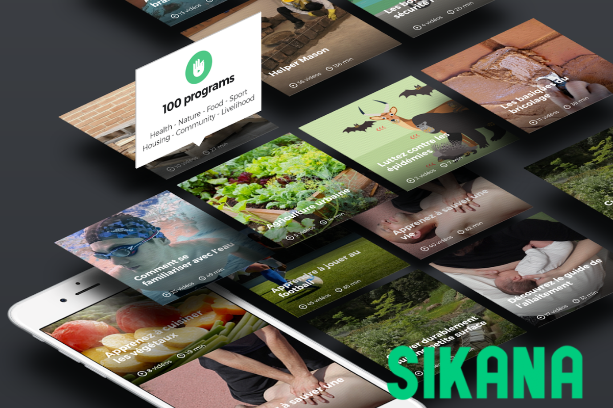
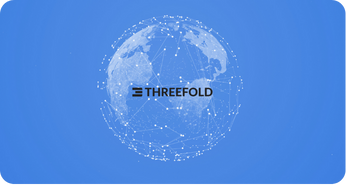

<!-- section 1 (header) -->



## **Decentralized Autonomous Cloud**

#### **The Leading Decentralized Cloud Marketplace**

 

ThreeFold’s self-healing autonomous system empowers anyone to become a cloud service provider – no technical expertise required – allowing people and organizations to buy, sell and use cloud resources autonomously and securely.

 

Together we are creating a cloud for everyone, owned by everyone.

 

<button class="blue_b">[Host The Cloud](/host)</button> <button class="green">[Deploy](https://dashboard.grid.tf)</button> 

<!-- <button>[Learn](https://manual.grid.tf)</button> -->

|||



<!-- section 2 (logos) -->



## **logo**



<!-- section 3 (Map) -->



### **Become a cloud & Internet service provider on**

## **The ThreeFold Grid**

Provide cloud and Internet capacity in your area and become a part of the largest and most advanced decentralized autonomous cloud network in the world.



<!-- section 4 (Host2 Earn) -->



<h1 class="big_header">Host2Earn</h1>

 

#### **It starts with Nodes**

 

3Nodes allow anyone to earn by providing compute, storage, and network capacity to the ThreeFold Cloud: pre-configured plug-and-earn nodes for beginners, or do-it-yourself nodes for builders. 

 

Earn TFT by adding capacity to the grid.

 

<button class="green">[Host The Cloud](/host)</button>
<button class="blue_b">[Explore Rewards](https://manual.grid.tf/knowledge_base/farming/farming_reward.html)</button>

|||



<!-- section 5 (Partners) -->



|||

# **TFT**

### **Used For Every Transaction**

## **Powering Our Ecosystem**

TFT powers ThreeFold and the expansion of a truly decentralized infrastructure that can scale any current or future technologies to the edge.

 

<button class="green">[Learn More](https://manual.grid.tf/documentation/threefold_token/threefold_token.html)</button>
<button class="blue_b">[TFT Market Price](https://www.coinbase.com/en-gb/price/threefold)</button>



<!-- section extra (Deploy) -->



#### What’s Possible With ThreeFold

 

## **Deploy On The Grid**





Anything that runs on Linux can run on the ThreeFold grid

|||

Virtual machines & gateways for easy deploying

|||

Use our one-click solutions or build your own

|||

Flexible advanced deployment options for experienced users





<button class="green">[Deploy Now](https://dashboard.grid.tf)</button>
<button class="blue_b">[Dive Deeper](/deploy)</button>



<!-- section 6 (ecentralized) -->



## **Why Decentralized Cloud**

#### How bringing data closer to the end user is beneficial for everyone



 



 

#### **Latency Reduction**

For real-time apps, central cloud delay is prohibitive. Edge Cloud cuts latency locally.

|||

 

#### **Privacy & Security**

By processing data locally, edge cloud reduces the exposure to data breaches and cyberattacks.

|||

 

#### **Data Sovereignity**

Empowers emerging markets with local data storage, granting digital sovereignty and autonomy.





 

#### **Performance**

Provides optimized bandwidth, reliability, and real-time processing which streamlines operations.

|||

 

#### **Cost Efficiency**

Minimizes data transmission over networks, cutting costs and reducing central server demand.

|||

 

#### **Scalability**

As devices multiply, central data centers face data overload. Edge cloud distributes processing and boosts scalability.



<!-- section 7 (Ecosystem) -->



## **Ecosystem**

### **Utilization Partners**

ThreeFold’s decentralized autonomous cloud will empower many projects and digital experiences as we grow. Here are some of the first projects to come alive.





#### **Social Network**

Earth Staking’s Social Network is the first Bitcoin Staking Layer 2 on Earth, collaborating with ThreeFold to improve security, scalability, and energy-efficiency.
        

|||

#### **Our World Free Zone**

ThreeFold is working with ZICTIA, on behalf of the Zanzibar government, to create the world’s first 100% Digital Free Zone – accessible and affordable for all.
        

|||

#### **Sikana**

Sikana is on a mission to empower individuals with practical skills through free educational videos – local content in local languages on top of local infrastructure.
        



 



<button class="blue_b">[Learn More](/partners)</button>



<!-- section 8 (news) -->



## **Latest News**





 

##### **A Sovereign Internet in Tanzania**

Dunia Yetu (Our World) is a collaborative and co-owned movement to redefine the digital landscape in Tanzania.

|||

 

##### **A Cooperative Model is Coming**

Cooperatives represent a well-tested form of collective organization and democratic governance.

|||

 

##### **Meeting Digital Demand at the Edge**

Learn what edge computing means and what it offers compared to centralized cloud infrastructures.



<!-- section 9 (Join In) -->



## **Join In**
 





Dive deeper into our technology

|||

Get assistance from our support team

|||

Participate in the conversation



 

