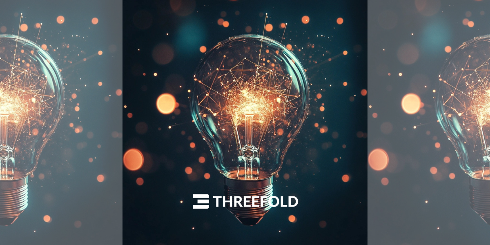
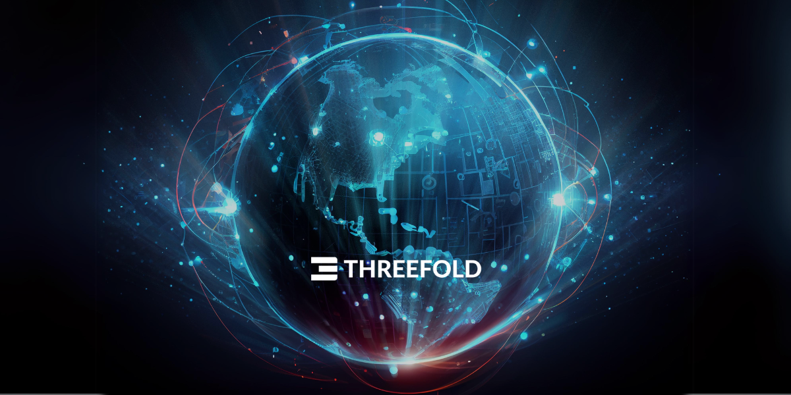

<!-- section 1 (header) -->



## **Self-Healing Data, Network, and Cloud Platform**

Imagine a system which can scale to a planetary level, is compatible with AI, Cloud, Web2, Web3 and Edge IT workloads, has the potential to recover from unforeseen events, provides 100% uptime, and allows any machine and human to communicate over the shortest, most direct path.

 

<button class="blue_b">[Host](/host)</button><button class="blue_b">[Deploy](/deploy)</button><button class="green">[About](/about)</button> 

|||



<!-- section 2 (logos) -->



## **logo**



<!-- section 3 (Map) -->



#### LIVE AND OPERATIONAL

## **Proven by a global community**

With ThreeFold, individuals, organizations, communities, countries, and network states deploy their own sovereign infrastructure. The ThreeFold Grid has been live and operational since 2017.

**Version 3.14 is live on Mainnet**



<!-- section 4 (Host the cloud) -->



#### THREEFOLD DIFFERENCE

## **A ground-up approach**

ThreeFold is not a protocol. We've developed foundational technology that runs directly on bare metal (the hardware). ThreeFold is likely the only active project with a truly scalable solution addressing the Internet and Cloud's core bottlenecks: data, cloud, and network.

 

<button class="blue_b">[Learn More](/technology)</button>





|||

### **Unbreakable Data**

Data cannot be compromised and always remains private, owned by you. A scalable system, to the planetary level. Can be distributed and stored in ways which are at least 10x more efficient and orders of magnitude more secure and reliable.

### **Autonomous Cloud**

Self-healing and self-driving cloud based on an efficient and secure operating system runs directly on the hardware. Can run any Web 2, Web 3, or AI workload at the edge of the Internet, with more scalability and reliability.

### **P2P Network**

End-to-end encrypted overlay network, always looking for the shortest possible path between participants. Logical Internet address securely linked to a private key. Unlimited scale and performance optimizations.



<!-- section 9 (Ecosystem) -->



<h4 class="green_text">REAL-WORLD IMPACT</h4>

## **Collaboration, Innovation, Evolution**

ThreeFold’s technological infrastructure will empower many projects and initiatives across sectors. Here are two key projects.





#### **OurWorld Free Zone**

 

ThreeFold is working with the Zanzibar Communication Corporation (ZICTIA), on behalf of the Zanzibar government, to create the world’s first 100% Digital Free Zone – accessible and affordable for all. The announcement was made August 2023, and progress has been ongoing behind the scenes since then. Updates expected Q4 2024.

      

|||

#### **Tanzanian Sovereign Internet**

 

In January 2024, ThreeFold announced in collaboration with The ICT Commission of Tanzania and Holochain a collaboration to deploy sovereign Internet in Tanzania, along with the introduction of coding academies and innovation hubs. The Dunia Yetu cooperative is being set up and efforts will ramp up in 2025.



<!-- section 5 (INCA) -->



|||

#### THE NEXT CHAPTER

## **Ready for commercialization**

For years, ThreeFold has been quietly and steadily developing its innovative technology, with a solid foundation of mature infrastructure that is now ready to take the next leap forward.

 

We are currently fundraising for the next stage of our project – major commercial expansion. This will involve the launch of the $INCA token on the Solana blockchain. If you are interested in learning more or taking part, please reach out.

 

<button class="blue_b">[Get in Touch](https://calendly.com/florian_threefold/30min)</button>



<!-- section 10 (news) -->



## **Top Blogs**





 

##### From the ground up: Three inventions that make ThreeFold possible

|||

 

##### The Evolution of the Internet: From free to controlled, and back again

|||

<h3 class="mt-0 font-semibold">JOIN IN</h3>

 

 <a href="https://manual.grid.tf" target="_blank">
    <h4 class="text-xl green_text font-normal my-0">Manuals</h4>
    
Dive deeper into our technology

    </a>
    

     

     <a href="https://threefoldfaq.crisp.help/en/" target="_blank">
    <h4 class="text-xl green_text font-normal my-0">Support</h4>
    
Get assistance from our Support Team

    </a>
    

      

      <a href="/community" target="_blank">
    <h4 class="text-xl green_text font-normal my-0">Community</h4>
    
Be part of our journey and participate

    </a>
    



