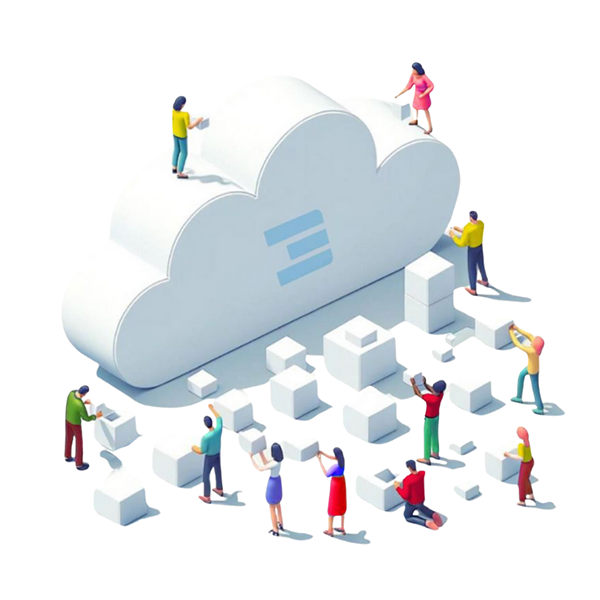

<!-- section 1 (header) -->



## **Decentralized Autonomous Cloud**

ThreeFold empowers anyone to become a cloud service provider – no technical expertise required – allowing people and organizations to buy, sell, and use cloud resources autonomously and securely.

 

Together we are creating a cloud for everyone, owned by everyone.

 

<!-- <button class="blue_b">[Host The Cloud](/host)</button> <button class="green">[Deploy](https://dashboard.grid.tf)</button>  -->

|||



<!-- section 2 (logos) -->



## **logo**



<!-- section 3 (Map) -->



#### Become a cloud & Internet service provider on

## **The ThreeFold Cloud**

Provide cloud and Internet capacity in your area and become a part of the largest and most advanced decentralized autonomous cloud network in the world.



<!-- section 4 (Host the cloud) -->



<h4 class="blue">HOST THE CLOUD</h4>

## **It starts with Nodes**

3Nodes are specialized computers running Zero OS, an operating system invented by the ThreeFold team, enabling anyone to provide decentralized compute storage, and network capacity to the ThreeFold Grid – and earn for it. 

 

<button class="blue_b">[Get A Node](/node)</button>
<button class="green">[Build A Node](https://manual.grid.tf/knowledge_base/farming/farming_reward.html)</button>

|||



<!-- section 5 (INCA) -->



|||

<h4 class="green_text">A BASE LAYER FOR DEPIN</h4>

<h3 class="font-semibold">Project INternet CApacity:
 the fourth generation of the ThreeFold Grid</h3>

We’ve developed robust technology that enables anyone to become a cloud and internet service provider. Our secure autonomous system is capable of self-healing without human intervention, giving users complete control over where their data and applications are hosted.

 

**Project INternet CApacity** s the fourth generation of the grid, representing the culmination of years of work by ThreeFold.

 

This project serves as the foundational layer for AI, Web2, Web3, and DePIN projects. It allows everyone to host their applications on a decentralized cloud infrastructure, providing reliable, sovereign storage, network, and compute capacity.

 

**ThreeFold has been building decentralized physical infrastructure long before the term “DePIN” was coined.**



<!-- section 6 (COLLABORATION) -->



<h4 class="green_text">COLLABORATION, NOT COMPETITION</h4>

## **A Decentralized Future for Us All**

 

ThreeFold believes in open-source collaboration to empower human potential. 

Together, we create, host, and co-own the foundational layer of an upgraded internet.

 

Our technology operates close to the hardware, enabling most Web2, Web3,  and DePIN projects to run on top of the ThreeFold Decentralized Cloud.

 

**Our story is a collective story. Let’s write it together.**

 

<button class="green">[Learn More](https://dashboard.grid.tf)</button>



<!-- section 7 (Autonomous) -->



<h4 class="blue">Building on a Proven Technology</h4>

## **What does it mean to be a truly Decentralized Autonomous Cloud for everyone?**

The ThreeFold Grid is a robust and production-ready ecosystem.

 





### Decentralized

No matter who or where you are, you can participate in the ecosystem. Anyone can host or use cloud services.

 

**Everyone has 100% control over their data and online presence.**

|||

### Autonomous

The ThreeFold software operates entirely without human intervention, allowing our cloud service providers to participate without needing to be experts.

 

**Owning the cloud has never been so easy.**

|||

### Cloud

Thanks to our innovative bare metal operating system and quantum-safe storage and network system, we achieve significant efficiency and security benefits.

 

Our aim is to allow all AI, Web2 and Web3 workloads to run natively on the grid



<!-- section 8 (Decentralized Cloud) -->



## **Advantages of a Decentralized Cloud**

#### How is bringing data closer to the end-user beneficial for everyone?



 



 

#### **Privacy**

Users maintain control over their data and minimize the risk of data breaches by processing information closer to its source.

|||

 

#### **Sovereignty**

Enables nations and individuals to control their Internet capacity, promoting digital independence through an autonomous cloud network.

|||

 

#### **Performance**

By processing data closer to users, it reduces latency and improves real-time responsiveness. 





 

#### **Cost Efficiency**

Reduces costs by minimizing data transmission over centralized networks.

|||

 

#### **Scalability**

As devices multiply, central data centers face data overload. Edge cloud distributes processing and boosts scalability.

|||

 

#### **Green**

Uses local resources to cut the carbon footprint and promotes eco-friendly practices with decentralized hosting.



<!-- section 8 (news) -->



## **What’s new?**
#### Latest ThreeFold Updates



 



 

##### **A Sovereign Internet in Tanzania**

Dunia Yetu (Our World) is a collaborative and co-owned movement to redefine the digital landscape in Tanzania.

|||

 

##### **A Cooperative Model is Coming**

Cooperatives represent a well-tested form of collective organization and democratic governance.

|||

 

##### **Meeting Digital Demand at the Edge**

Learn what edge computing means and what it offers compared to centralized cloud infrastructures.

|||

<h3 class="mt-0 font-semibold">JOIN IN</h3>

  

  <a href="https://manual.grid.tf" target="_blank">
     <h4 class="green_text font-normal my-0">Manuals</h4>
     
Dive deeper into our technology

     </a>
     

      

      <a href="https://threefoldfaq.crisp.help/en/" target="_blank">
     <h4 class="green_text font-normal my-0">Support</h4>
     
Get assistance from our Support Team

     </a>
     

       

       <a href="/community" target="_blank">
     <h4 class="green_text font-normal my-0">Community</h4>
     
Be part of our journey and participate

     </a>
     



