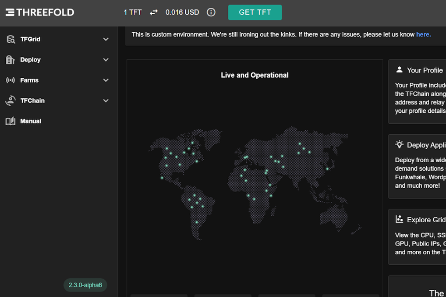

<!-- section 1 (header) -->



 
 
 
 
 
 
 
 
 
 
 

### **Decentralized Autonomous Cloud**

ThreeFold is the world's first system enabling anyone to become a cloud and Internet service provider, empowering people and organizations to buy and sell cloud resources autonomously and securely.

 
 
 
 
 
 
 
 
 
 
 





### The ThreeFold Grid

### **Connected globally and commercially ready**

#### **Mainnet: 3.12** | Testnet: 3.12 | Devnet 3.13





### **Key Features: Under the hood**

Take a look at some of the key innovations and features which make ThreeFold come alive.





#### Zero OS

 

A minimalistic, more efficient server operating system retaining the Linux kernel but fundamentally redesigned for heightened security, efficiency, and support for true peer-to-peer and decentralized workloads.

|||

#### Smart Contract for IT

 

Secure, verified, multi-signed authentication enabling the autonomous reservation of capacity, storing files, deployment of applications, and more, in just a few clicks.

|||

#### Mycelium

 

A new overlay network layer designed to enhance the existing Internet infrastructure while remaining compatible with all current applications, empowering true peer-to-peer communication.





#### IaC, Kubernetes, & VMs

 

A unified computing platform that integrates Infrastructure as Code (IaC), Kubernetes, and Virtual Machines for automated, scalable, and efficient application deployment and management.

|||

#### Dedicated IP Leasing

 

Unlock stability and control with dedicated IP leasing. Ensure consistent access, enhance security, and boost your online reputation with a unique IP address tailored exclusively to your needs.

|||

#### Quantum Safe File System

 

A FUSE-based filesystem utilizing Zero-Stor as its backend. Metadata is safeguarded to prevent loss, inheriting Zero-Stor's benefits and simplifying usage for developers and system administrators.





 
 
 
 
 

### **Build your sovereign environment**

Define your infrastructure requirements, reserve your capacity, and seamlessly scale your workloads and databases anywhere the network exists. Leverage the inherent benefits of autonomous IT such as better pricing, network security and safety, lower carbon footprint, and more.

 
 
 
 
 





### **Environments**





#### Virtual Machines

 

We provide full virtual machines for comprehensive computing needs, offering complete control and flexibility. Additionally, our micro virtual machines cater to lightweight tasks, optimizing resource usage and scalability for efficient operations.

|||

#### Kubernetes

 

Kubernetes is the standard container orchestration tool. On the ThreeFold Grid, Kubernetes clusters can be deployed out of the box. We have implemented K3S, a full-blown Kubernetes offering that uses only half of the memory footprint.

|||

#### NixOS MicroVMs

 

A minimalistic virtual machine environment based on the NixOS Linux distribution. The NixOS MicroVM leverages these principles to create a highly customizable and reproducible virtual machine environment.





### **Ready Community Solutions**

Already optimized for deployment in just a few clicks.

<button>[Playground](https://playground.grid.tf/#/)</button>





### **Around the ecosystem**





 

##### Technology

#### New Dashboard UI/UX

 

Dive into the latest features and functionalities of our newly-upgraded dashboard – the go-to platform for managing and deploying on the TF Grid.

 

<button>[More](/newsroom/newdashboardux)</button>

|||

 

##### Partnership

#### Internet for Tanzania

 

We are collaborating with the government and local tech community to enable Dunia Yetu (Our World in Swahili), a sovereign digital future for Tanzania.

 

<button>[More](/blog/dunia-yetu)</button>

|||

 

##### Governance

#### A Cooperative Model

 

In H1 2022, ThreeFold is moving to a cooperative model, a well-proven mechanism for decentralized governance. See what it will mean for the ecosystem.

 

<button>[More](/blog/threefold-cooperative)</button>





### **A participatory movement**





 
 

 

#### Learn how to get involved

 

Get to know the different ecosystem roles and some of the people driving the movement forward.

 

<button>[Community](/community)</button>

 
 

|||

 
 

 

#### Get started with the manual

 

Learn how to take action – from connecting capacity to deploying on top of it to buying the token.

 

<button>[Manual](https://manual.grid.tf/)</button>

 
 

