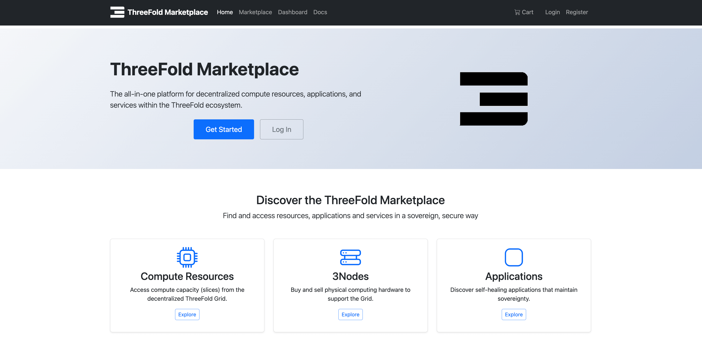

June brought major development across the ThreeFold ecosystem! 🌟 We announced one of our  most exciting project, the ThreeFold Marketplace, prepared for the upcoming DePIN Summit Africa, shared a demo walkthrough, and more. Let’s look at the highlights!

 

### **The ThreeFold Marketplace**

In June, we announced the ThreeFold Marketplace, a major step forward in our mission to build a truly global, peer-to-peer Internet for everyone. The marketplace is an all-in-one platform that connects users and providers to discover, exchange, and manage compute resources, applications, and services within the ThreeFold ecosystem.

It simplifies how participants engage with ThreeFold by bringing everything into a single, accessible hub, including:

* Compute resources
* Certified hardware
* Decentralized apps
* Expert services

The use of TFP (ThreeFold Points) enables fair and flexible exchanges, and together with a unified dashboard, the marketplace opens up new opportunities for collaboration and commercial growth across the community.

Development on both the front-end and back-end is actively underway, and the alpha testing phase will be announced soon. We will continue to share updates and details in the coming weeks as we finalize the official launch plan. 

→ Read our [announcement blog](https://www.threefold.io/newsroom/threefold-marketplace/)

→ Experience the marketplace firsthand in this walkthrough with our co-founder Kristof.
 📺 Watch the full demo [here](https://youtu.be/-8CvcZwLRDE)

 

### Demo Time: Node Status Bot High Availability Deployment

In this demo, Scott shows the latest developments in the Node Status Bot, which provides an example of how to create resilient applications on the ThreeFold Grid.
 📺 Watch the full demo [here](https://youtu.be/4fLz-HyNj_w?si=6psLBjtFtLlZXWkb)

 

### GEP Minting Proposal for June

As many of you know, the grid experienced an unexpected outage from June 13 to June 17, due to a central domain infrastructure issue beyond the control of individual farmers. To ensure a fair outcome for everyone affected, a [proposal](https://forum.threefold.io/t/gep-minting-june/4611) has been submitted to exclude this period from the minting uptime calculation for all farmers.

🗳️ Voting is now open and will run until July 7 at 6.05 PM CEST.
 You can cast your vote via the [dashboard](dashboard.grid.tf) under “TFChain - DAO” or in the TF Connect app.

We invite everyone to participate and share their feedback.

 

### DePIN Summit is here

This month, our team worked closely with the EV3 and Share teams to prepare for [DePIN Summit Africa 2025](https://depinsummit.xyz). The event has begun this week on July 2nd in Mombasa 🇰🇪 and continues on July 4th and 5th in Zanzibar 🇹🇿.

**Recap**: The summit brings together experts and builders to explore the future of decentralized infrastructure, with a focus on practical solutions and the Global South. ThreeFold co-founders Kristof De Spiegeleer and Florian Fournier will be speaking to highlight our role in this growing movement.

We’ll be sharing more insights and takeaways from the event in July.

 

 

### **Looking Ahead** 
Stay tuned in July for several updates! You can expect more details on the Marketplace, on-the-ground insights from the summit, news about the 3.18 release, and 2 demos this month. Keep an eye on our [news channel](https://t.me/threefoldnews) for the latest developments. 👀

 

Thanks for reading and taking part. See you next time!