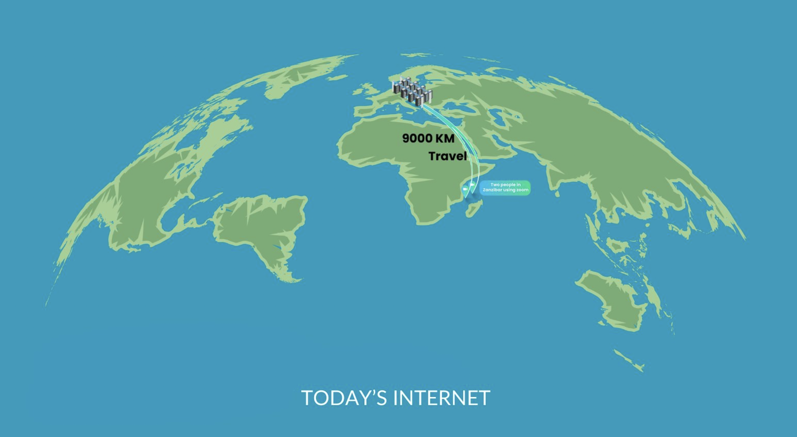
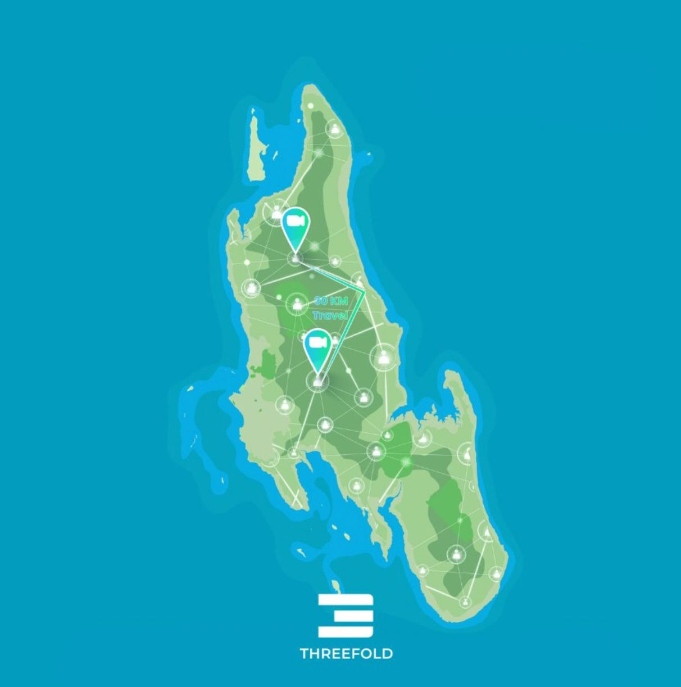

 

### **A Sovereign Internet, By and For Tanzania**
The current centralized Internet model works for the few and is GDP negative for most countries. Most nations do not own their Internet, instead with fiber optic cables transferring and storing their data in data centers in the Global North. A relatively small set of big companies have access to and control over the data of billions of citizens, making us a product. The result is a loss of national money, data, sovereignty and influence.

 

Our feasibility study showed that Tanzania is losing around 10 Billion USD per year from not having their own infrastructure and applications. The current centralized model needs to change.

 

**Centralized model vs ThreeFold model**

 

    

 

    

 

Tanzania shares this vision and together with ThreeFold has embarked on a mission to build their own sovereign Internet infrastructure where the people are in control and are the ones benefiting from their own digital lives. To achieve this mission, Tanzania’s ICT Commission has partnered with us to leverage ThreeFold technology to enable a Tanzanian-owned Internet infrastructure and allow local communities to build the digital solutions that they need and want on top of the grid.

 

ThreeFold’s unique technology is ideal for this transformative project because of its affordability, efficiency, accessibility, reliability, security, sustainability and ability to be co-owned. By focusing on everyone owning and running things together, an autonomous digital future shaped by the community will become a reality. It will be a Tanzanian internet designed by and for the people.  

 

The project “Dunia Yetu”, meaning Our World in Swahili, was announced in January 2024 at a conference in Dar Es Salaam organized by ThreeFold and Tanzania’s ICT Commission. The next steps which the team is currently working on include helping local communities to deploy nodes across Dar es Salaam as well as opening a coworking hub. This hub will empower startups and entrepreneurs in Dar es Salaam to learn more about the ThreeFold grid and focus on knowledge sharing to help them build their own digital solutions on top of the grid. Learn more about Tanzania’s new internet [here](https://www.threefold.io/blog/dunia-yetu/). 

 

<iframe src="https://player.vimeo.com/video/919967495?h=340e62170b&amp;badge=0&amp;autopause=0&amp;player_id=0&amp;app_id=58479" frameborder="0" allow="autoplay; fullscreen; picture-in-picture; clipboard-write" style="position:absolute;top:0;left:0;width:100%;height:100%;" title="TBC NEWS JANUARY 19, 2024 | Sovereign internet: A game changer to Tanzania"></iframe>

