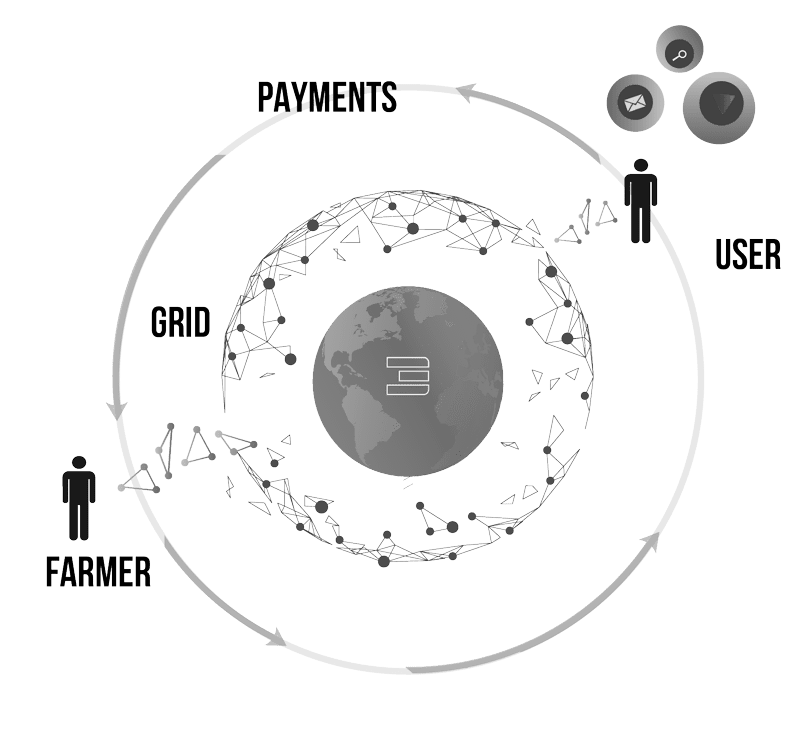
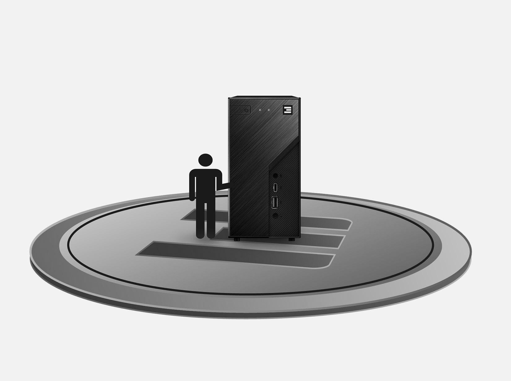

<!-- section 1 (be the Internet) -->



## Decentralizing  **the Internet Economy**

ThreeFold creates an entirely new decentralized Internet economy that allows anyone to join the world’s fastest growing market – the Internet.

 

<button>[Learn About TFT](https://manual.grid.tf/threefold_token/threefold_token.html)</button>
<button>[Get TFT](https://manual.grid.tf/threefold_token/buy_sell_tft/buy_sell_tft.html)</button>





## **DECENTRALIZING  THE INTERNET ECONOMY**



<!-- section 2 (Meeting Emerging Demand) -->



## Meeting **Emerging Demand**

Data has become the most valuable commodity on earth, the Internet infrastructure is experiencing significant growth.  While the current centralized model is facing limitations, ThreeFold can scale to the edge to service the emerging demand.





 

125 zetabytes of storage capacity needs to be  
created to meet demand for data in the upcoming years. 
That is a number with 21 zeroes!

|||

|      |  |
| ----------- | ----------- |
|  | &nbsp;$800 billion of revenue is expected for the cloud market by 2025 |
|  | &nbsp;&nbsp;&nbsp;Over seventy billion new devices are expected to be online by 2025 |
|  | &nbsp;&nbsp;&nbsp;Over one billion people are still expected to get digital access by 2025|



<!-- section 3 (world of farmers) -->



## The **Missing Layer**

While many projects have created bits and pieces of what a decentralized Internet would look like, ThreeFold is decentralizing the entire Internet model. The blockchain world is missing this decentralized foundational layer. ThreeFold provides the peer-to-peer Internet infrastructure to interconnect the entire blockchain and web3 space.

 
 



<!-- section 4 (THE CURRENCY) -->



|||

## The Currency of the **Decentralized Internet**

TFT is a utility token that allows people to hold current and future Internet capacity on the ThreeFold Grid. It incentivizes an open ecosystem where anyone can connect and utilize Internet capacity without any intermediaries.

<button>[Learn About TFT](https://manual.grid.tf/threefold_token/threefold_token.html)</button>



<!-- section 5 (OPEN NETWORK) -->



## Open **Network**

3Nodes provide Internet capacity for millions of people using ThreeFold’s Planetary Network, and you earn TFT for doing so. And because of a unique operating system, called Zero-OS, once turned on your 3Node runs by itself.



 



<!-- | Proof-Of-Capacity     |  |Proof-Of-Utilization  |
| ----------- | ----------- | ----------- |
| People earn TFT as monthly income for connecting Internet capacity to the ThreeFold Grid. |  | People buy TFT to store data and run applications privately on a peer-to-peer Internet infrastructure.  -->

### Proof-Of-Capacity

People earn TFT as monthly income for connecting Internet capacity to the ThreeFold Grid.

|||

|||

### Proof-Of-Utilization

People buy TFT to store data and run applications privately on a peer-to-peer Internet infrastructure.



<!-- section 6 (OPEN NETWORK) -->



## Loyalty **Rewards**

The ThreeFold blockchain automatically scans wallets and provides up-to 60% discounts on the utilization of the ThreeFold Grid. The more TFT you hold across time, the higher the discounts.

|||



<!-- section 7 (OPEN NETWORK) -->



|||

## A Real **Utility Token**

TFT is minted only when new Internet capacity is added to the ThreeFold Grid. A limited supply of 4 Billion TFT has been set to ensure the value keeps steady for the years to come with rising demand for a decentralized Internet.



<!-- section 8 (BURN AND FARM) -->



## Burn and Farm  **Equilibrium**

Burning permanently removes TFT from the circulating supply when the ThreeFold Grid gets used. It ensures a positive impact on pricing while ensuring rewards for all current and future nodes.

|||



<!-- section 9 (partners) -->



## Join the **Movement**

Get TFT today and participate in the realization of a truly decentralized world.





## **Decentralizing  the Internet Economy**







<!-- section 10 (partners) -->



## **Believers in TFT**

<button>[Check All Partners](/partners)</button>


