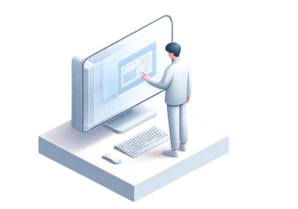
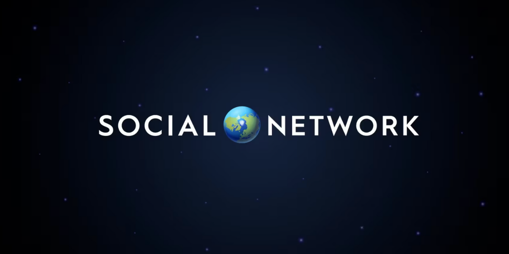
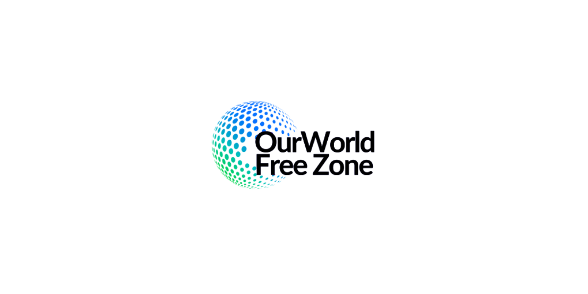
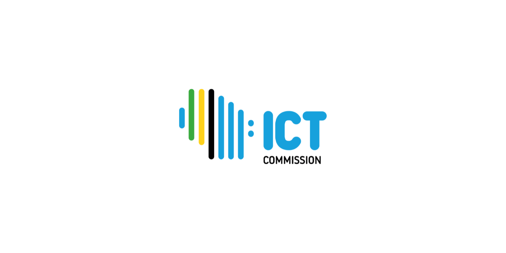
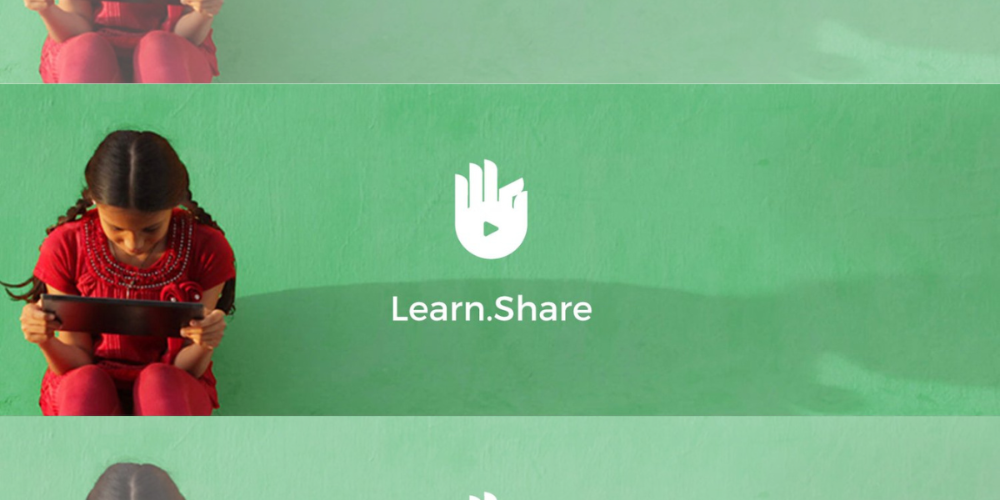
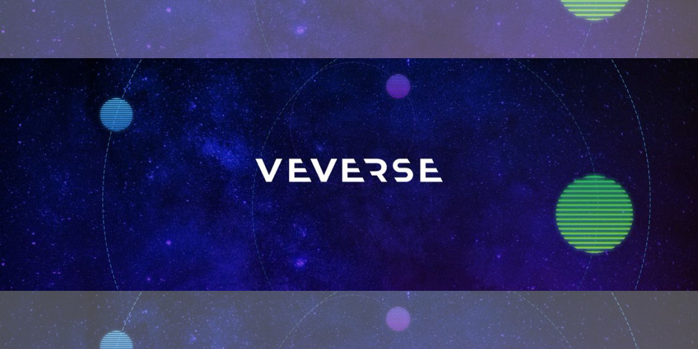
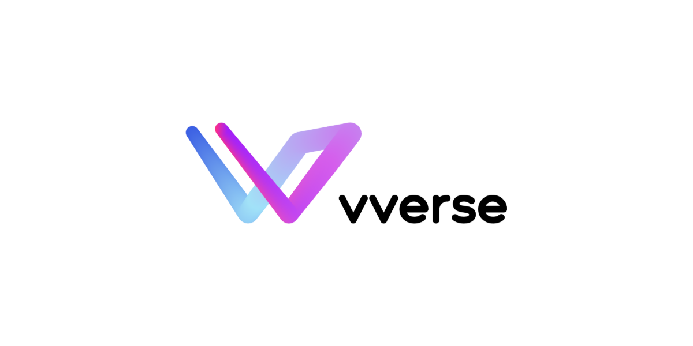

<!-- section 1  -->

<!-- 

    

      

       

          

            
          

        

        

          

            <h2>Build the Future</strong></h2>
            
Deploy and administer on a decentralized autonomous edge infrastructure. Experience true ownership of your deployments with a decentralized framework. Evolve the way you create and deploy innovative solutions, with greater scalability, efficiency, privacy, and security.

            

            <button class="mx-1 my-2"><a target="_blank" href="https://manual.grid.tf">Our Manuals</a></button>
            <button class="mx-1 my-2"><a target="_blank" href="https://dashboard.grid.tf">Grid Dashboard</a></button>
            

          

        

      

    

  
 -->



|||

## **Utilization & Ecosystem**

ThreeFold’s decentralized autonomous cloud is in its third generation and ready to go commercial. It will empower many projects and digital experiences as we grow.





## **Community Utilization**

ThreeFold has developed extensive technology and tooling for developers and system administrators. ThreeFold is designed for compatibility. Grid users are provided with familiar ways of deploying and managing resources. From decentralized cloud computing to blockchain integration to overseeing infrastructures and optimizing performance, there is a breadth of options for smooth and efficient operation.

<button>[Manual for Developers](https://manual.grid.tf/developers/developers.html)</button>
<button>[Manual for Sysadmins](https://manual.grid.tf/system_administrators/system_administrators.html)</button>

|||





### Core Partners
## **Coming in 2024**





 

#### Blockchain
### **Social Network**

The ThreeFold Grid is operating as a backbone for Earth Staking’s recently launched Social Network, the first decentralized Bitcoin Staking Layer 2 on Earth. Our Cloud infrastructure offers a robust, low-level decentralized framework, perfectly suited to empower Earth Staking’s vision of improving the accessibility, security, scalability, reliability, and energy efficiency of the Bitcoin Network.

|||

 

#### Country
### **OurWorld Free Zone**

OurWorld Digital Free Zone is a collaboration between the Government of Zanzibar and OurWorld Venture Creator, and is powered by the ThreeFold Grid. It is the world’s first digital freezone, a special economic zone that brings together some unparalleled regulatory benefits.





 

#### Country
### **ICT Commission (TZ)**

We have partnered with the Tanzanian government and ICT Commission to implement decentralized autonomous cloud & Internet infrastructure across Tanzania. Providing compute, storage and network locally we can enable Tanzania to create a self-reliant sovereign digital ecosystem for a better digital future.

|||

 

#### Education
### **Sikana**

Later this year (H2 2024), ThreeFold's decentralized autonomous cloud infrastructure will power Sikana, a non-profit organization working to equip people with practical skills through free educational video programs.





 

#### Metaverse
### **VeVerse**

VeVerse provides a platform bridging virtual worlds, digital assets, and people, empowering artists, museums, and game developers to construct captivating environments where users can explore, play, and connect. Our Edge Cloud facilitates the metaverse’s unique requirements providing low latency, scalability, security and bandwidth optimization. 

|||

 

#### Metaverse
### **VVerse**

VVerse is a next-generation sociality and entertainment platform linking users, creators, and businesses in a virtual 3D world. Our Edge Cloud facilitates the metaverse’s unique requirements providing low latency, scalability, security and bandwidth optimization. 

